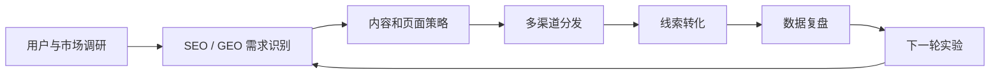

# Google 官方数字营销课程 2026 AI 更新：对 GenGrowth AI Growth 服务包的启发

## 结论

Google 官方数字营销课程不是普通“课程推荐”，而是一套可用于校准 GenGrowth 增长服务能力的基础框架。它覆盖用户、渠道、SEO、社媒、邮件、数据分析、电商、客户忠诚度，并在新版中加入 AI skills，适合作为 GenGrowth 的 AI Growth / SEO-GEO 服务包、Ops 培训和增长 SOP 的参考底座。

PM 判断：这条情报优先级为 P1。它不直接带来客户转化，但能帮助我们把内部能力拆成可交付、可训练、可验收的服务模块。

---

## 1. 来源

### 1.1 小红书笔记

- 原始短链：`http://xhslink.com/o/39dfjbge10b`
- 解析后笔记：`https://www.xiaohongshu.com/discovery/item/6a3bccf40000000006020e3d`
- 标题：谷歌官方出的数字营销课（必读推荐
- 作者：温哥华楠仔

笔记核心信息：

1. 作者几年前系统学过 Google 官方数字营销课，认为非常有用。
2. 近期发现课程在 2026 年更新，并新增 AI 课程板块。
3. 作者认为这套课覆盖 Digital Marketing 的完整框架，包括：
   - 用户调研
   - 选赛道
   - 痛点研究
   - SEO
   - 社媒
   - Email marketing
   - 漏斗模型
   - 忠诚度培养
   - 每个节点的数据分析
   - 团队协作
4. 作者提到官方推荐学习周期约 3 到 6 个月。

证据边界：小红书笔记是二次推荐，不是官方课程说明。课程结构、时长、AI 更新等关键信息以官方页面为准。

### 1.2 官方来源

- Coursera：Google Digital Marketing & E-commerce Professional Certificate  
  `https://www.coursera.org/professional-certificates/google-digital-marketing-ecommerce`
- Grow with Google：Digital Marketing & E-commerce  
  `https://grow.google/certificates/digital-marketing-ecommerce/`

官方页面核验到的信息：

| 项目 | 核验结果 |
|---|---|
| 课程名称 | Google Digital Marketing & E-commerce Professional Certificate |
| 平台 | Coursera / Grow with Google |
| 课程数量 | 8 门课 |
| 推荐学习节奏 | Coursera 显示约 6 个月，每周 10 小时 |
| 课程规模 | 官方页显示超过 190 小时 instruction + practice-based assessments |
| AI 更新 | 页面标注 New AI skills，包含用 AI 做市场理解、策略、邮件营销和文案等 |
| 工具覆盖 | Google Ads、Google Analytics、Canva、Constant Contact、Hootsuite、HubSpot、Mailchimp、Shopify、Twitter 等 |

---

## 2. 课程结构拆解

| 序号 | 官方课程 | 核心内容 | 对 GenGrowth 的价值 |
|---|---|---|---|
| 1 | Foundations of Digital Marketing and E-commerce | 数字营销和电商基础、岗位职责、营销漏斗、策略框架 | 可做增长服务框架的基础层 |
| 2 | Attract and Engage Customers with Digital Marketing | SEO、SEM、品牌认知、网站内容优化 | 直接对应 SEO / GEO 内容获客服务 |
| 3 | From Likes to Leads: Interact with Customers Online | 社媒营销、内容互动、从关注转线索 | 可补社媒分发和线索转化链路 |
| 4 | Think Outside the Inbox: Email Marketing | 邮件营销、自动化、转化和维护 | 可补客户 nurture（培育）和复购流程 |
| 5 | Assess for Success: Marketing Analytics and Measurement | 指标、营销分析、效果衡量、洞察表达 | 可转成增长复盘和客户月报模板 |
| 6 | Make the Sale: Build, Launch, and Manage E-commerce Stores | 电商店铺搭建、商品、订单、运营 | 与当前 GenGrowth 主线弱相关，可作为电商客户补充模块 |
| 7 | Satisfaction Guaranteed: Develop Customer Loyalty Online | 客户忠诚度、复购、客户关系管理 | 可转成 retention / referral 诊断模块 |
| 8 | Accelerate Your Job Search with AI | 用 Gemini / NotebookLM 等做求职、简历、面试 | 对 GenGrowth 业务价值较低，可跳过或弱化 |

---

## 3. 新增 AI skills 的产品意义

官方页面显示课程包含 AI training / New AI skills，并列出若干与营销直接相关的 AI 使用场景：

1. 用 AI 理解受众。
2. 用 AI 启动营销策略想法。
3. 用 AI 比较两个 campaign proposal（营销活动方案）。
4. 用 AI 改进 email marketing。
5. 用 AI brainstorm website copy ideas（网站文案创意）。
6. 在求职课程中使用 Gemini、NotebookLM、Gemini Live 等工具。

PM 判断：Google 的更新说明了一个趋势——数字营销教育正在从“渠道和指标”升级为“AI 辅助的营销工作流”。但它仍然偏职业入门训练，不是 AI-native 增长系统。

对 GenGrowth 来说，重点不是学习“怎么用 Gemini 写文案”，而是把 AI 变成可交付流程：

---

## 4. GenGrowth 服务包机会

### 4.1 AI Growth Audit（AI 增长诊断）

目标用户：
- 有官网 / SaaS / AI 工具 / 内容站，但增长路径不清楚的早期团队。

场景：
- 客户有内容、产品或页面，但不知道为什么没有自然流量、没有线索、没有转化。

服务内容：

| 模块 | 诊断问题 | 可交付物 |
|---|---|---|
| 用户 | 目标用户是否清楚？痛点是否可搜索？ | 用户画像与需求假设表 |
| Search | SEO / GEO 需求是否覆盖？ | 搜索需求地图 |
| 内容 | 页面是否匹配搜索意图？ | 内容差距清单 |
| 社媒 | 内容是否能从曝光导向线索？ | 分发路径建议 |
| Email / 私域 | 是否有 nurture 流程？ | 客户培育流程草图 |
| 数据 | 是否有指标闭环？ | 指标看板建议 |
| AI | 哪些动作可自动化？ | AI workflow 建议清单 |

MVP：
- 做一个 1 页诊断表 + 1 个样例客户复盘。

验收标准：
- 能在 90 分钟内完成一次轻量诊断。
- 输出不少于 5 个可执行增长实验。
- 每个实验有负责人、优先级、指标和止损条件。

### 4.2 GenGrowth Growth Agent Checklist

目标：把 Google 课程里的模块转成 Agent 可执行检查清单。

检查项：

1. 用户画像是否明确？
2. 搜索需求是否覆盖？
3. 页面是否匹配搜索意图？
4. 内容是否能复用到 X / LinkedIn / 小红书？
5. 是否有 lead magnet（线索诱饵，比如模板、报告、免费诊断）？
6. 是否有明确 CTA（下一步动作）？
7. 是否有指标追踪？
8. 是否有复盘节奏？
9. AI 是否被用于调研、内容、分析和复盘，而不只是写文案？

MVP：
- 先做 Markdown checklist。
- 由 PM 用 1 个 GenGrowth 自己项目试跑。
- 再决定是否做成 Slack / Kanban 自动检查任务。

### 4.3 Ops / 实习生训练路径

不建议直接让 Ops 或实习生完整学完 190 小时课程。建议 PM 先抽成内部训练路径：

| 阶段 | 学什么 | 为什么 |
|---|---|---|
| P0 | 营销漏斗、SEO 基础、指标基础 | 让执行动作不脱离转化目标 |
| P1 | 社媒、邮件、内容复用 | 支持分发和线索培育 |
| P2 | 电商、求职 AI 模块 | 当前弱相关，暂缓 |

验收方式：
- 不看是否拿证书。
- 看是否能完成 1 份客户增长诊断表、1 份内容差距分析、1 份周复盘。

---

## 5. 与 GenGrowth 当前任务地图的关系

| GenGrowth 当前方向 | 结合度 | 判断 |
|---|---:|---|
| AI Builder 情报产品化 | 中 | 可作为“增长类情报转服务包”的案例 |
| GenGrowth 增长情报 | 高 | 可补充增长情报结构和诊断维度 |
| 产品化与服务化机会 | 高 | 可转成 AI Growth Audit / SEO-GEO 诊断包 |
| Slack 主协作流 | 中 | 可把 checklist 做成 PM / Ops 频道任务模板 |
| Wiki / GBrain 资产化 | 高 | 值得沉淀为服务包底层框架 |
| 团队协作 | 中 | PM 抽框架，Ops 执行训练，玲姐只在定价/资源投入时决策 |

---

## 6. 风险与边界

1. 不能把职业课程当作增长结果保证。  
   课程能提供框架，但客户增长还取决于产品、市场、内容质量和分发能力。

2. 不能把 AI 更新夸大成 AI-native 增长系统。  
   官方课程新增 AI skills，但多数是 AI 辅助营销，不是端到端 Agentic SEO / GEO。

3. 不建议为了证书投入过多时间。  
   对 GenGrowth 最有价值的是课程结构、练习模板和官方框架，不是证书。

4. Ops 学习必须有产出任务。  
   不能变成“学习了很多课但没有业务产出”。

---

## 7. 推荐下一步

### PM / 彪哥

1. 建一份《Google Digital Marketing → GenGrowth AI Growth 服务包对照表》。
2. 抽出 10 个最重要的增长诊断问题。
3. 用 GenGrowth 自己的一个项目跑一次内部诊断。

### Ops

1. 暂不完整学习课程。
2. 等 PM 输出精简学习路径后，再按模块学习。
3. 每学一块必须输出一个业务产物，例如内容差距表、关键词表、周复盘。

### 玲姐

暂不需要 CEO 决策。只有当这套框架要产品化为正式服务包、定价或对外销售时，再升级给玲姐判断。

---

## 8. 可验收产物建议

| 产物 | 负责人 | 优先级 | 验收标准 |
|---|---|---|---|
| Google 课程模块对照表 | PM | P1 | 8 门课映射到 GenGrowth 服务模块 |
| AI Growth Audit 诊断表 | PM | P1 | 1 页，可用于真实客户或内部项目 |
| Growth Agent Checklist | PM / Hermes | P2 | 可转成 Slack / Kanban 检查任务 |
| Ops 精简学习路径 | PM | P2 | 每个学习模块绑定一个业务产出 |
| 对外内容选题 | PM / Ops | P2 | 形成 1 篇文章或 3 条短内容选题 |

---

## 9. 相关阅读

- [[AI Builder 情报产品化]] — 将外部 AI / 增长情报转成产品机会。
- [[GEO 决策链诊断包]] — 可承接本页中 SEO / GEO 相关模块。
- [[GenGrowth 增长情报系统]] — 将分散情报沉淀为可执行增长任务。
