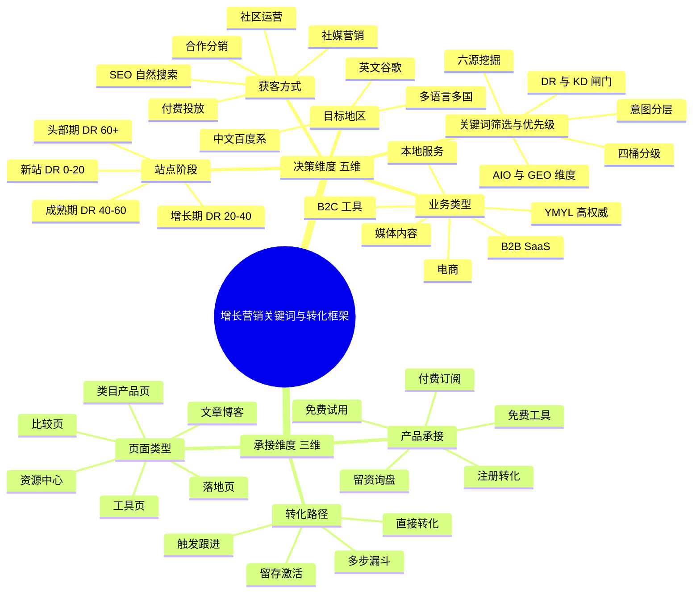

# 增长营销关键词与转化框架（路由总览）

> **本文档定位**：跨获客方式（SEO / 社媒 / 买量）+ 跨业务类型 + 跨站点阶段的关键词研究与转化承接的**入口与路由**。
>
> **当前状态**：v0.1 框架草稿。仅搭建维度结构与文档地图，各维度的具体内容由后续专项 SOP 实现。
>
> **使用方式**：根据"决策维度"组合定位你的场景，到「SOP 文档地图」找到对应的执行 SOP；不在已有 SOP 覆盖范围 → 找最接近的 SOP，对照决策维度差异做调整。

---

## 一、为什么需要这份框架

单一关键词 SOP 无法覆盖所有营销场景。不同业务类型（B2B SaaS / 电商 / 媒体 / 本地）、不同站点阶段（新站 / 老站 / 头部站）、不同获客方式（SEO / 社媒 / 买量）、不同目标地区（英文谷歌 / 中文百度），需要的关键词逻辑、内容形态、转化路径完全不同。

**本框架的目标**：建立一张全景图，把"决策维度"和"承接维度"显性化，避免在错误的场景套用错误的 SOP，也避免做了关键词没承接、做了内容没转化的断点。

---

## 二、框架全景图

> 渲染说明：mermaid mindmap 在 Obsidian / GitHub / VS Code 原生支持；如需导出为图片，可在 Mermaid Live Editor（mermaid.live）粘贴预览。

---

## 三、决策维度（5 维）

> 当前为占位说明，待后续专项 SOP 填充实质内容。

### 维度 1：业务类型

不同业务类型决定关键词的搜索意图分布、内容形态偏好、转化路径长度。

| 业务类型 | 关键词重心 | 对应 SOP |
|---|---|---|
| B2B SaaS | Commercial 意图 + 长尾决策词 | `keyword-research-sop-b2b-saas.md`（待建）|
| B2C 工具 / 早期 SaaS | 信息词 + 工具型查询 | `03-seo/keyword-research-sop.md`（已有，当前主用）|
| 电商 | Transactional 意图 + 类目长尾 | `keyword-research-sop-ecommerce.md`（待建）|
| 媒体 / 内容站 | 信息词 + 时效热点 | `keyword-research-sop-media.md`（待建）|
| 本地服务 | 地理修饰词 + 即时意图 | `keyword-research-sop-local.md`（待建）|
| YMYL（医/金/法）| 权威解释词 + E-E-A-T | `keyword-research-sop-ymyl.md`（待建）|

### 维度 2：站点阶段

不同 DR 阶段决定 KD 阈值、产能分配、是否启动刷新与修剪。

| 阶段 | DR 区间 | 重心 |
|---|---|---|
| 新站起步 | 0–20 | 极小词 + 长尾矩阵 70%+ + Featured Snippet 抢位 |
| 增长期 | 20–40 | 快速胜利 60% + 长尾 40%（当前主 SOP）|
| 成熟期 | 40–60 | 新内容 30% + 刷新 70% + 上位词挖掘 |
| 头部期 | 60+ | Topic Authority + 内链权重分配 + 修剪 |

> 待建：`keyword-research-sop-mature-site.md`（增长期+成熟期）、`keyword-research-sop-head-site.md`（头部期）

### 维度 3：目标地区

不同地区使用不同的搜索引擎、工具链、内容生态。

| 地区 | 主搜索引擎 | 关键词工具 | 内容生态 |
|---|---|---|---|
| 英文谷歌 | Google | Ahrefs / SEMrush / DataForSEO | YouTube / Reddit / Quora |
| 中文百度系 | 百度 / 神马 | 5118 / 站长之家 / 爱站 | 知乎 / 小红书 / 视频号 / 抖音 |
| 多语言多国 | Google + 本地引擎 | 各地区工具组合 | 本地化重做关键词，hreflang |

> 待建：`keyword-research-sop-chinese.md`、`keyword-research-sop-multi-region.md`

### 维度 4：获客方式

SEO 只是其中一种获客方式。不同获客方式有不同的关键词逻辑（或"非关键词逻辑"）。

| 获客方式 | 关键词角色 | 对应 SOP |
|---|---|---|
| SEO（自然搜索）| 主战场，本框架核心层 | 见维度 1 各业务类型 SOP |
| 社媒营销 | 话题词 + 标签词，意图弱、共鸣强 | `02-social-media/social-keyword-sop.md`（待建）|
| 付费投放（SEM / 信息流 / 应用商店）| 商业意图词 + 出价 + 落地页匹配 | `paid-acquisition-keyword-sop.md`（待建）|
| 合作分销（联盟 / KOL / 渠道）| 合作方关键词协同 | （后续规划）|
| 社区运营（Reddit / Quora / 知乎）| 真实用语 + 趋势话题 | 见 SEO SOP 来源 4 |

### 维度 5：关键词筛选与优先级

沿用「六源挖掘 → 四桶分级」方法论。详见 `03-seo/keyword-research-sop.md`。

核心闸门：
- **DR 差距闸门**：Top10 平均 DR 与自有站差距 ≤ 30
- **KD 与意图分层**：四桶（趋势词 / 快速胜利 / 长尾词 / 战略词）
- **AIO 风险标注**：AI Overview 高风险词改用交互工具/对比型切入
- **GEO 引用潜力**（v2.2 新增）：识别更易被 ChatGPT / Perplexity 引用的词型，调整内容形态

---

## 四、承接维度（3 维）

> 关键词只是入口。流量进来后能否转化，取决于承接侧的设计。这一层常被 SEO 团队忽视，却是 ROI 真正的杠杆。

### 承接 1：页面类型

| 页面类型 | 适配关键词 | 承接职能 |
|---|---|---|
| 落地页 | Transactional / Commercial | 短路径转化 |
| 工具页 | Informational + 工具型查询 | 即时使用 + 留资 |
| 文章博客 | Informational + 长尾 | SEO 主战场 + 教育引导 |
| 比较页（vs / best）| Commercial | 决策辅助 + 引导 CTA |
| 类目 / 产品页 | Transactional 类目长尾 | 电商主战场 |
| 资源中心 / 集群中枢 | 长尾矩阵 | 集群权重 + 长尾流量汇聚 |

> 待建：`page-type-design-sop.md`

### 承接 2：产品承接

关键词流量进入后，产品侧需要承接。常见承接形态：

- **免费试用**（产品试用版本 / 沙箱）
- **免费工具**（SEO 工具站常用，工具即内容、内容即工具）
- **注册转化**（账号体系，用户进入产品池）
- **付费订阅**（直接订阅 / 试用转付费）
- **留资询盘**（B2B SaaS 常用，进入销售跟进）

> 待建：`product-funnel-handoff-sop.md`（与产品方协作设计）

### 承接 3：转化路径

| 路径类型 | 适用场景 |
|---|---|
| 直接转化 | 强 Transactional 意图 + 短决策周期（电商、低价订阅）|
| 多步漏斗 | B2B 长决策 / 高客单（试用 → demo → 销售跟进）|
| 触发跟进 | 留资 → 邮件序列 / 销售跟进 / 再营销 |
| 留存激活 | 注册后激活、付费后留存（生命周期运营）|

> 待建：`conversion-funnel-sop.md`

---

## 五、SOP 文档地图

> 当前文档体系状态：[已有] = 已落地可用，[待建] = 已规划尚未起草，[暂缓] = 暂不规划。

### 关键词研究层

| SOP 文档 | 覆盖场景 | 状态 |
|---|---|---|
| `03-seo/keyword-research-sop.md` | 内容/工具站 + 新到中等 DR + 英文谷歌（主用）| [已有] v2.2 |
| `03-seo/keyword-research-sop-mature-site.md` | 老站刷新与修剪 | [待建] |
| `03-seo/keyword-research-sop-ecommerce.md` | 电商分层 | [待建] |
| `03-seo/keyword-research-sop-local.md` | 本地 SEO | [待建] |
| `03-seo/keyword-research-sop-chinese.md` | 中文百度系 | [待建] |
| `03-seo/keyword-research-sop-geo.md` | GEO/AEO 专项 | [待建]（当前嵌入主 SOP 第八章）|
| `03-seo/keyword-research-sop-b2b-saas.md` | B2B SaaS 决策意图词 | [待建] |
| `03-seo/keyword-research-sop-media.md` | 媒体 / 新闻站 | [待建] |
| `03-seo/keyword-research-sop-ymyl.md` | YMYL 高权威领域 | [待建] |
| `02-social-media/social-keyword-sop.md` | 社媒话题词 | [待建] |
| `paid-acquisition-keyword-sop.md` | 付费投放词 | [待建] |

### 执行操作层

| SOP 文档 | 覆盖场景 | 状态 |
|---|---|---|
| `03-seo/day0-diagnosis-sop.md` | Day 0 诊断与建库 | [已有] |
| `03-seo/seed-client-growth-experiment-template.md` | 种子客户增长实验模板 | [已有] |
| `03-seo/keyword-sheet-setup.gs` | Sheets 自动化模板 | [已有] |

### 承接转化层

| SOP 文档 | 覆盖场景 | 状态 |
|---|---|---|
| `page-type-design-sop.md` | 页面类型设计 | [待建] |
| `product-funnel-handoff-sop.md` | 产品承接对接（与产品方协作）| [待建] |
| `conversion-funnel-sop.md` | 转化漏斗设计 | [待建] |

---

## 六、使用流程

1. **定位场景**：先确认你的场景 = 业务类型 + 站点阶段 + 目标地区 + 获客方式 的组合
2. **找对应 SOP**：在「SOP 文档地图」找到该组合对应的专项 SOP
3. **降级路径**：不在已有 SOP 覆盖范围 → 找最接近的 SOP，对照"决策维度"差异做调整
4. **同时考虑承接**：页面类型 / 产品承接 / 转化路径，避免做了关键词没承接、做了内容没转化

---

## 版本记录

| 版本 | 日期 | 主要变更 |
|------|------|---------|
| v0.1 | 2026-05-08 | 初稿：搭建 5 决策维度 + 3 承接维度框架，建立 SOP 文档地图（已有/待建状态），引出后续专项 SOP 路径；mermaid mindmap 全景图作为视觉入口 |

---

*配套文档：*
- *主用 SOP：`03-seo/keyword-research-sop.md` v2.2（内容/工具站 + 新到中等 + 英文谷歌）*
- *Day 0 诊断：`03-seo/day0-diagnosis-sop.md`*
- *实验模板：`03-seo/seed-client-growth-experiment-template.md`*
