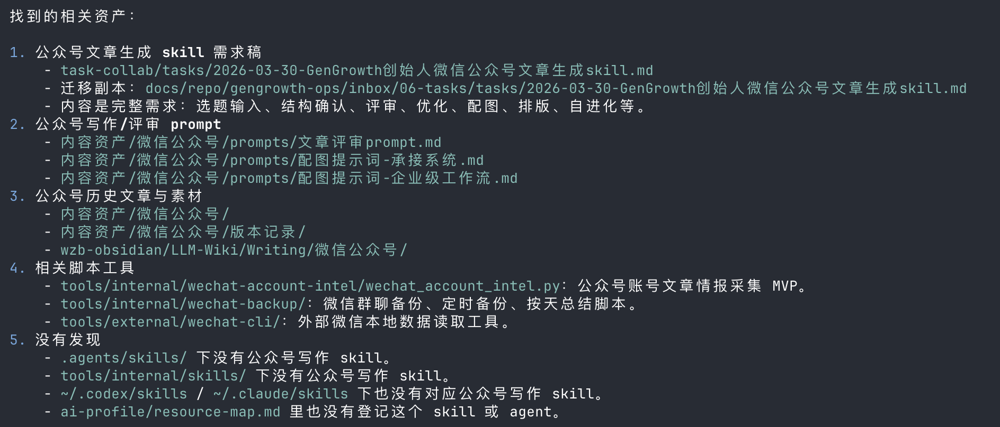

目的：
1）结合gengrowth的内部应用情况，通过微信公众号、创始人x账号、linkedin等社交媒体的发声，增加gengrowth的公信力、获取种子用户；
2）加强团队本身对工程化管理及业务的思考，推进落地

需求来源1：AI热点观察——把ai-builder-daily、research-reports中的内容落地，先从gengrowth的内容产出开始。

需求来源2：基于业务实验，负责人王玲

问题：
Hermes的建议和思路，如何跟现在我在CLI终端创建的skill/agent打通，高效协同，产出文章？
比如5.24，ai-builder-daily提供的这几个选题，我决定要做选题2，那么，如何让ai结合我们gengrowth实际工程的情况以及建立的skill（实际未wan ch），输出各个平台的文章？
