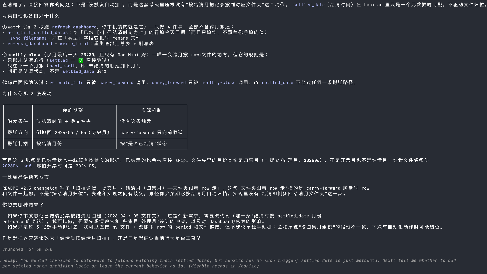

需求来源：Lynne，实际管理痛点

工作流程：
1、识别邮箱中的发票：从邮件中识别、提取发票及invoice，并明确**报销人**（ 通过邮箱所属人识别，比如来源为  wl.ecwhu@gmail.com、wangling@gengrowth.ai，报销人为王玲）

2、提炼发票信息并命名：开票月份（若开票日期为20260505，则开票月份为202605）、发票分类（报销类目，需要AI先出规则，给出符合会计记账的自动分类识别）、发票金额、发票编号、发票对象。发票文件命名规则：发票发生月份-报销类目-发票金额，示例：202601-差旅费用-¥1000。——注意：发票发生日期和抓取/自动写入的日期，一般不一致

3、发票存档：将找到的发票或invoice，自动存入“GenGrowth-wiki/发票/”目录下，按照抓取日期和报销人自动建文件夹，并按发票命名规则将发票存档，示例：GenGrowth-wiki/发票/202601/王玲/202601-差旅费用-¥1000.pdf
——检查：每次抓取邮箱中的发票，存档前先检查发票编号是否已存在于文件夹中，若已存在，不重复写入，不存在才写入

**4、写入《报销表》：Google文档or飞书文档？
1）字段：
- 员工姓名：自动写入报销人（固定员工，有限选项）
- 提交日期：自动写入当前填入日期
- 
- 发票所属期：自动写入发票所属期
- 报销类型：自动写入发票分类
- **项目名称：自动写入**
- 报销金额：自动写入发票金额
- 发票编号：自动写入
- 发票对象：自动写入（国内的发票抬头：广州进格智能科技有限公司；海外invoice抬头：一般是员工个人）
- 发票附件：自动链接存档的发票
- 
- 报销事由：手动写入，可为空
- 备注：手动写入，可为空
- 审批状态：4个选项（”待审批“”审批通过““审批不通过”“驳回”），创建时自动写入“待审批”，支持手动调整
- 打款状态：2个选项（“未打款”“已打款”），创建时自动写入“未打款”，支持手动调整
- 报销打款时间：手动文本输入（格式示例：202605）

**2）其他要求：可按照审批状态、报销人、月份查看，方便财务打款及对账，示例：**

5、人工补充处理：手动输入备注、处理报销并标注报销状态（见以上手动填写的字段）

6、发票归档或转移：每月最后一天24点，识别报销表中发票的报销状态，已报销的发票即归档，保持文件夹中的位置不变；未报销的发票，自动转移文件夹，将发票挪入下个月。比如2026年01月31日24点，202601/王玲，文件夹中有部分发票报销状态为未报销，则自动将这些发票挪入202602/王玲
——检查：文件夹是否存在重复发票编号，不允许同一张发票，同时出现在不同文件夹中

1、发票字段补充：开票月份（到月份即可，比如202605）。记录真实的财务费用归属，后续用于财务利润核算

2、发票字段补充：**发票类型（国内发票 or invoice）、发票对象**（billing to），并按**发票类型、发票对象**统计报销金额，示例：国内发票：广州进格智能科技有限公司-币种CNY-XXX，invoice：Wang Ling-币种USD-XXX——默认只报销，对象为广州进格智能科技有限公司的国内发票

3、报销日期，当前修改状态后自动记录当前时间，并且可以支持更改，基本满足需求。但单张发票和本月汇总那里没有联动？另外：是否允许批量操作，而不是单个确认？
——确认是否有存报销日期或报销月份这个字段，方便后续会计支出对账
**——确认：未报销的发票，下个月的发票附件以及记录都会挪到下个月？**

4、wzb、mby的发票怎么进入？如何控制权限？

**5、文档存放月份：报销和发票，两个文件夹的月份，按照“报销月份”来分，当月未结束、未报销时，默认按照提交月份来放。月度结束时，该文件夹内存在的发票都是已结清状态**

6、手动添加发票后，如何处理？需要支持将手动导入的发票，自动转换成符合格式的发票文件标题、按发票编号去重处理、之后自动写入报销表

7、`28e4bd5e`这个内部编号是否有意义？如果没有特殊用途，可以删掉

8、在报销目录中，补充报销总表
已结清：
- 发票类型、发票对象、报销打款时间、报销人、报销金额、（提交日期、发票日期、发票编号、报销类型、备注）
未结清：
- 发票类型、发票对象、报销人、报销金额、（提交日期、发票日期、发票编号、报销类型、备注）

其他待王玲确认：
- 王玲个人的发票应该走备用金，该发票是否应该单独存放——确认单独存放
- invoice走备用金模式，不报销——待代理公司已确认

---

**2026-06-05补充&调整需求**

**0、异常问题：发票类型识别错误，普票错为专票**

1、从王玲邮箱拉出来的发票，需要支持手动修改报销对象，可改为“公户”（这些发票是直接公司打款的，不用再次报销），对应打款日期默认为发票日期，并在本月汇总中，在“可报销”后面另起一个表：“公户已打款”，字段跟“可报销”的分类一样

2、将备用金和报销发票分开
a）新建“invoice”目录，结构同“发票”目录，将发票类型为invoice的票据，挪到该目录下
b）新建“备用金”目录，在原来字段的基础上，增加“付款证明”（先手动放文件链接）、“人民币金额”（默认按原币、开票日期当天汇率计算，支持修改），这两个字段

3、再跑一遍流程：drop文件夹增加了一张900的发票，邮件中增加了2张pockyt invoice和1张京东发票

待办：
invoice目录，支持存放“付款证明”的文件，命名同时标注原货币金额、支付的人民币金额，例如付款记录的命名：202606-办公费-HK$7599-¥6692.39——怎么将截图放进来，并识别出来这是付款记录、关联的invoice？还有交易时间、对应人民币金额需要读出来

❯ docs/05-governance/finance-payments/报销，报销目录下，[Image #2] [Image #3] [Image #4] 这几张发票的结清时间，已手动调整为202604和202605，为何发票以及报销记录没有自动挪到对应的文件夹中？

1、调整需求：结清后按结清月归档
2、已结清状态有歧义：无论是员工报销状态，还是公户打款，勾选后dou hui