> 📌
> 1.
> 目前Dev portal支持多语言，创建app后可以在右上角切换语言
> 2.
> 小游戏内涉及网络请求的所有域名都必须提前在平台完成注册：配置请求域名
> 3.
> 第三步小游戏入驻的步骤合同合规可以和游戏调试的步骤同步进行
> 4.
> Here is the English Version

# 【中文版】

## 一、简介

小游戏通常是指一种简单易玩、体积较小、加载速度快，可在各种平台上运行的游戏类型。它们一般具有轻量级的特点，不需要玩家进行长时间的下载和安装过程，通常可以在网页浏览器、手机应用程序（如facebook、抖音等）或专门的小游戏平台上直接打开和玩。

- 总结：小游戏在中国地区已展现巨大市场空间和商业化潜力，中国区2024年小程序游戏广告收入$4.5B，占游戏广告市场大盘的40%。而目前海外市场竞争仍不饱和，对于开发者来说机遇难得。
- 市场机会：21 年为非中移动小游戏大盘的历史高点，73亿美金流水，9亿美金抽成收入，FB 占比 > 80%。由于 FB 从 22 年开始减少对小游戏板块的投入，过去三年流水从63亿 ->38亿，开发者需要新的平台来承接这巨大的利润空间。
- 用户价值：用户侧视角，抖音小游戏留存已好于Facebook且仍在提升（次日留存 14% vs 10%，7 留 7% vs 5%），TikTok与抖音生态具有相似性，且目前官方平台也在积极引入厂商参与测试。

TikTok mini-game的入驻全链路如下，详细流程等信息可见下文。

## 二、小游戏入驻

### 2.1 账号注册

1. 注册

在 TikTok for Developers 网站完成注册，进入My organizations 管理组织

1. 创建组织并管理开发成员

创建组织，组织名为主体全称，该信息会在about页面展示给终端用户，注意创建后名称无法修改（如：ByteDance Inc. ）。

可以在组织内添加其他开发成员

准备用于测试小游戏的的TikTok账号，建议一个US账号一个JP账号

新建TT账号可以尝试拔掉sim卡+调整系统语言至海外国家（比如想注册美国账号，就修改系统语言至英语【美国】）

### 2.2 合规审查

1. 资质规范

资质认证背景-为什么要进行资质认证？

| 审核环节 | 目标 |
| --- | --- |
| 企业/个人主体认证<br>证明“我是我”<br> | 1.<br>确认身份的真实性与合法性<br>确认开发者是否是真实存在的个体或公司组织，以防止以下行为：<br>冒充他人开发并发布应用<br>利用虚假身份诈骗用户或获取敏感数据<br>侵犯品牌、知识产权（比如冒充知名公司发布App）<br>2.<br>对接法律责任与合规监管<br>TT 作为平台方，需要能在必要时找到责任主体，尤其在出现以下情况时：<br>用户隐私泄露<br>应用违规收集数据<br>涉嫌诈骗或违法内容<br>3.<br>防止刷号和滥用开发者资源<br>使用多个假身份注册大量账号，滥用 API 等资源<br>提交恶意或低质量应用扰乱平台生态（如通过Posting API大量发布黑灰产内容）<br>4.<br>教育/研究用途需验证组织的真实性<br>Research API 等仅开放给研究机构的API，能获取TT的全部公开视频、评论和账号信息，必须验证主体的真实性 |

具体要求规范

为了确保开发者体验的安全性，开发者组织在门户创建账户时，需要验证机构身份并提供详细文件和认证。请注意，未来商家资质验证对于发布小游戏和短剧以及使用变现功能将是强制性要求。

> 关于认证具体操作、文件要求以及注意事项，您可以参考
> 资质校验一站式入驻指南【开发者查看版】文档完成企业认证，通常3个工作日内完成审查。

为完成验证，您需要以电子方式提交 1）贵公司的营业执照或业务认证文件；2）您的主要或法定代表人的政府签发带照片的身份证明；3）您的主要代表人的授权证明，关于文件具体说明可参考：

| 文件类型 | 具体说明 | 举例说明 |
| --- | --- | --- |
| 营业执照/业务认证文件（Business certificate）<br> | 此文件必须由贵公司注册所在国家或地区的主管政府机构签发。<br>您的文件必须包含以下信息，且填写过程中与文件信息保持一致：<br>完整的法定商业名称（本地语言名称与英文名称都需要包含）<br>企业注册号<br>地址（请确保填写的地址信息与文件保持一致） | 以香港地区为例：<br>未满一年的企业可提供 NNC1 文件<br>满足一年的企业可提供 NAR1 文件<br> |

#### 2. 合规审查（非常重要，尽早完成！）

- External Information Sharing（EIS）审查

> 关于EIS

- USDS TPRM（上架美国地区需要）

> 请尽快提交本步骤：提交完成后，通常需要美国15-30个工作日处理。

对于需要上线至美国地区的游戏，还需单独通过USDS TPRM审查，以确保开发者可获取美国地区用户数据，整体流程如下。

完成企业资质认证后，点击Business，根据图中步骤完成美国合规审查：

填写美国上架合规问卷：⚠️填写时需要注意不要出现受限地区，否则上架美国之后无法开通IAA

完成问卷填写后，需能够勾选Protected data上架美国后才能开通IAA

#### 3. 行业准入审核

完成企业认证之后，需要提交游戏行业准入申请

点击Apply进行提交

> 需要提交已发布的代表作品链接，以证明行业发行资质，如果是代理发行公司，请上传研发公司授权书。

1. Google Play, Apple Store, Steam, Taptap, 或者抖音/微信小游戏平台的游戏作品链接，例如：

Google Play/ App Store作品链接

微信小游戏作品链接

抖音小游戏作品链接

- 如果同集团下的不同主体，请提供证明材料
- 如果是代理发行请提供授权文件（如研发公司授权邮件）的PDF文件。
- 如果无官方授权文件/邮件，可参考授权文件PDF示例

### 2.3 合同签署

根据我们的新流程，开发者可以通过Dev Portal自动完成协议确认与签署操作，平台将合同和变现优化为线上化流程。

1. 确认前置条件已完成

需要开发者确认自己已经完成企业资质认证，如果认证完成后，developer portal 会如图中所示；如果还未完成前置条件，无法进行合同签署和变现功能开通，请参考：企业认证

1. 开通IAA/IAP以及合同签署

在developer portal上点击Monetizaition按钮，点击Enable开通IAA/IAP(至少一个)，会自动弹出合同模板，阅读之后点击submit完成合同签署。

1. 收款设置

完成变现能力开通后，在收款设置中完成信息填写：公司信息 / 税务信息 / 银行信息

> 【收款主体】与【企业认证】主体需保持一致

> 【收款主体】与【企业认证】主体不一致时，为确保实体身份验证的准确性，开发者需在页面中上传文件，进行人工审核，审核时效为 1-3 个工作日。具体操作见下方：

| 截图 | 具体说明 |
| --- | --- |
| <br> | 可以提供以下证明材料：<br>营业执照  (Business License)<br>银行开户证明 (Bank Account Certificate) —— 建议包含唯一的身份识别号码（如纳税人识别号或执照注册号）。<br>若上述文件不足以证明实体的一致性，开发者可提交额外的补充材料以提供进一步证据。目前尚无标准化的补充文件类型 —— 任何能为验证流程提供合理支撑的材料均可被接受。 |

完成开通后，应该如下图所示；如果显示有未完成的部分，请联系客服

如果看到如下界面，说明IAA/IAP能力已经开通好了，后续代码包上选之后会有相关数据，点击Ad Placement 可以创建广告位。

### 2.5 创建app - 配置基础信息

在Dev Portal点击"Connect an app"

点击“Organization”并选择组织

在创建App的环节选择“TikTok mini game”

创建App之后，配置基础信息之前，可以在右上角切换多语言，选择中文🇨🇳

#### 2.5.1 应用基本信息（必填）

入口：侧边导航栏点击“basic information”

填写项和说明

| 字段 | 要求 | 是否要审核 | 是否支持多语言 |
| --- | --- | --- | --- |

#### 2.5.2 小游戏基础库版本配置

为保障小游戏新增API稳定运行，避免低版本环境下功能报错、程序崩溃；修复旧版数据加密、权限管控漏洞，防止用户敏感信息泄露；同时减少适配成本、统一运行环境、契合平台规则，助力小游戏融入生态并高效迭代，开发者在进行基础配置时，需设置基础库最低版本。

在“基础信息配置”中找到「最低支持的基础库版本（Minimum supported library version）」位置，根据小游戏的需要，在下拉菜单中选择最低支持的基础库版本。如果需要了解具体基础库版本包含的内容，可以点击页面的《基础库更新日志》查看详情。

> 请注意

#### 2.5.3 配置多语言版本（非必填）

入口：在侧边导航栏点击“localization”

选择你要添加的语言版本，并填写对应内容

这里选择的语言，和用户的TikTok App语言设置是相匹配的。

1. TikTok App语言设置是localization中已配置且online status = online的语言，则用户看到的app name、app icon、app description、Terms of service URL和Privacy policy URL，会展示localization中该语言配置的信息（注意此处非游戏内玩法的本地化，仅是TikTok客户端的基础信息本地化，游戏本地化需在游戏内开发配置）
1. TikTok App语言设置在localization中未配置，或是online status = offline的语言，则用户看到的app name、app icon、app description、Terms of service URL和Privacy policy URL，会展示默认版本中的信息

### 2.6 调试游戏

TikTok 小游戏开发者调试指南

### 2.7 测试验收 - 发版审核

小游戏开发完成后，建议开发者需按照自测指南进行功能自测、开放能力自测和性能自测，确保产品符合提审标准。达到提审标准后，开发者需通过 Dev Portal 提交最终版本的审核申请，并选择上线的区域。平台将进行验收，通过后小游戏才会上线。

⚠️如果是H5转native小游戏直接上线：在用测试账号验证的时候，如果当前Minis存在灰度版本，那么目标用户与灰度用户从线上入口minicenter访问当前应用，将打开灰度版本。

我们致力于营造安全、友好的 TikTok Mini App 平台环境。审核将分为两部分：

1. 安全类审核：应用不得出现非法、色情、暴力、仇恨言论等任何触及安全底线的内容，并须做好未成年人保护。
1. 非安全类审核：对体验与必接能力（如性能、双端加载、核心功能、支付、协议、开放能力走查）进行核查，确保用户获得完整、流畅的使用体验。

整体审核时效为 1–3 个工作日，结果将通过平台、站内信及邮件同步给您。审核通过后，即可在后台点击「发布」按钮，完成应用上线。

如果您的 Mini App 审核失败，您可根据以下审核原因对游戏进行排查：

> **[电子表格]** 
> *请在飞书中查看原始表格*

### 2.8 游戏发布

> h5游戏：上传 .zip 文件。未压缩文件大小不得超过 200 MB。文件上传后，将进行安全扫描。请确保文件符合要求后再上传。

| 步骤 | 截图 | 步骤 |
| --- | --- | --- |
| 上传代码包 | <br> | 1.<br>请先添加测试用户（必备）<br>前往测试与权限标签页，添加发布前可预览应用的 TikTok 账号。<br>然后，在【代码版本】标签页，上传代码素材。上传的代码版本将在预览会话中显示。上传过程可能需要几分钟。<br>2.<br>使用二维码进行预览<br>应用上传完成后，可在代码版本卡片上找到预览按钮。点击按钮即可进行预览。<br>在 TikTok 上登录测试用户账号并使用 TikTok 应用扫描二维码。<br> |

### 2.9 提交审核

| 步骤 | 截图 | 内容 |
| --- | --- | --- |
| 1 | <br> | 1.<br>完成企业资质认证 |
| 2 | <br> | 1.<br>确保基本信息的审核通过 |

## 三、小游戏经营

### 3.1 基础能力

以下为部分推荐接入的关键能力，其他SDK等基础功能接入，请参考 
TikTok Mini Games JS API Reference

##### 静默登录（Login）（必接能力）

能力状态：已上线 ✅

> 📌
> 能力简介：获取用户 唯一标识（open_id） 以及后端 Open API 鉴权凭证（access_token）

##### 用户授权（authorize）（按需接入）

> TikTok 小游戏用户授权（authorize）接入指南

##### 激励+插屏广告（IAA）

能力状态：已上线✅，更多广告样式敬请期待

> TikTok 小游戏广告（IAA）接入指南 // TikTok Mini Game Ad (IAA) Integration Guide

##### 端内支付（IAP）

能力状态：已上线✅，目前仅支持 TikTok Beans 支付

### 3.2 留存能力 （必接能力）

| 复访入口 | 入口优先级 | 是否必接 | 推荐理由 |
| --- | --- | --- | --- |
| 桌面快捷方式 | P0 | 必接 | 能大幅缩短用户复访路径，让玩家无需通过宿主 APP 层层查找游戏入口，从桌面一键即可启动，尤其适配高频玩家的使用习惯，既强化了游戏在用户设备中的存在感，又降低了复访操作成本，间接带动用户活跃度与留存率提升。 |
| 个人主页侧边栏 | P0 | 必接 | 作为平台内置的稳定入口，能帮助用户建立 “找历史小游戏就去侧边栏” 的使用心智，形成固定复访路径，减少用户流失，同时可搭配礼包、代币等激励引导用户使用，平台数据已验证其能显著提升次日及 7 日留存。 |
| 异形卡<br> | P2<br> | 选接<br> | 依托平台算法优势，能被动触达高活跃、高付费、高留存的核心用户群体，精准召回历史激活但未持续活跃的优质用户，厂商无需额外投入买量成本，就能高效触达潜在高价值用户，以及捞回历史激活有价值用户。 |
| IM分享裂变（私信） | P2 | 选接 | 借助社交关系链实现 “以老带新”，经好友分享进入的用户自带信任基础，用户价值、付费意愿和留存率均优于其他渠道，尤其适合高社交属性游戏。但该入口依赖游戏特性和设计，高社交属性游戏有显著优势，可根据自身游戏情况选择接入。 |

##### 桌面快捷方式

能力状态：安卓端和iOS（4140版本以上）均已上线✅

> 📌
> 能力介绍：可以将小游戏快捷方式添加到手机桌面上
> 适用范围：所有小游戏，尤其广告投放游戏，可有效拉升留存，GMV贡献度平均40%-60%
> 接入文档：加桌功能为框架能力和api调用，回调及礼包教育相关能力的接入方案，待上线后更新。

- 用户路径演示
1. i.
越早越佳：尽量在用户登入早期出现引导，如进入游戏后首屏，若游戏需先进行新手引导，则在完成后直接出现“添加桌面”复访活动，尽量保证在前期完成用户教育；
1. ii.
显著位置：游戏首屏一级入口图标展示，以及可以在登陆界面提供“添加桌面”入口；
1. i.
奖励丰富度高：提供2个及以上福利（均为游戏内硬通货-货币、体力或装备等），保证福利丰富度，提高对用户吸引力；
1. ii.
奖励投入力度大：因桌面在后续能够承接更多老用户收入，建议在该入口的复访活动引导奖励高于其他入口，比如同奖励数量或者品质提升，增加用户对于该入口认知；
1. c.
文案引导：可选做，单独提供一个添加桌面引导icon，告知用户“添加桌面”详细步骤；
1. i.
每日签到：高优推荐，设置“每日奖励”，用户每日从桌面进入游戏可获得相应奖励（奖励力度可低于首次添加），增强用户对于该入口认知，培养复访习惯，若后续内部验证该入口对于游戏价值较高，可更换更高阶奖励用于强化引导；
1. ii.
icon保留：用户完成添加桌面或者领取每日进入奖励后仍保持添加桌面icon提醒，强化用户对这一入口认知；
1. e.
退出引导：用户退出游戏后提供“立即添加”引导（平台机制，可检查自身游戏是否有）
1. f.
其他可尝试方向：游戏内任务或签到任务增加桌面快捷方式引导，完成后可获得奖励；

| 出现时机 | 福利设置 | 文案引导 | 完成后引导 | 退出引导（平台机制） |
| --- | --- | --- | --- | --- |
| <br> | <br> | <br> | <br> | <br> |

- 接入方案建议

| 接入方案 | 主要设置点 | 操作亮点总结 |
| --- | --- | --- |
|  | <br>一级入口<br>首次奖励<br>7日阶梯奖励<br> | 1.<br>新手引导结束后立即出现添加桌面入口展示 |

- 技术方案

TikTok 在 41.0.0 版本支持这些 API。使用前请先使用 canIUse 进行版本兼容。

- 描述：判断小游戏的 API、回调、参数等是否在当前版本可用。
- 参数：
- 示例：
- 描述：添加到桌面。
- 参数：
- success：执行成功的回调
- fail：执行失败的回调

```
代码块
TypeScript
复制
type schema = string
Use ${api}.${method}.${param}.${option} to call
- api: API name
- method: call mode, valid values are return, object, callback
- params: parameter or return value
- options: valid values of parameters or attributes of return values
```

```
代码块
TypeScript
复制
if (TTMinis.game.canIUse("addShortcut")) {
  TTMinis.game.addShortcut({
    success: () => {
      console.log("success");
    },
    fail: () => {
      console.log("fail");
    },
    complete: () => {
      console.log("complete");
    }
  })
}
```

```
代码块
TypeScript
复制
type success = () => void;
```

```
代码块
TypeScript
复制
type fail = (error: {
  error_code: number;
  error_msg: string;
}) => void;
```

- complete：执行完成的回调（包含成功和失败）

```
代码块
TypeScript
复制
type complete = () => void;
```

- 示例：

```
代码块
TypeScript
复制
TTMinis.game.addShortcut({
  success: () => {
    console.log("success");
  },
  fail: (error) => {
    console.log("fail", error);
  },
  complete: () => {
    console.log("complete");
  }
```

1. getShortcutMissionReward
- 描述：判读用户是否可以领取添加到桌面奖励。
- success：执行成功的回调

```
代码块
TypeScript
复制
type success = () => void;
```

- fail：执行失败的回调

```
代码块
TypeScript
复制
type fail = (error: {
  error_code: number;
  error_msg: string;
}) => void;
```

- complete：执行完成的回调（包含成功和失败）

```
代码块
TypeScript
复制
```

- 示例：

```
代码块
TypeScript
复制
TTMinis.game.getShortcutMissionReward({
  success: ({ canReceiveReward }) => {
    console.log("success", canReceiveReward);
  },
  fail: (error) => {
    console.log("fail", error);
  },
  complete: () => {
    console.log("complete");
  }
})
```

###### 如何调试奖励结果

1. ttmg dev 打开调试环境

```
代码块
TypeScript
复制
cd path/to/your/game
```

1. 选择新建启动模式
1. 设置桌面快捷入口启动模式
1. 扫码模拟快捷方式入口启动调试奖励发放结果

| <br> | <br>代码块<br>JavaScript<br>复制<br>TTMinis.game.getShortcutMissionReward({<br>  success: ({ canReceiveReward }) => {<br>    console.log("success", canReceiveReward);<br> |
| --- | --- |

##### 复访奖励（侧边栏）

能力状态：已上线✅，支持回调

> 📌
> 能力介绍：支持用户从TikTok个人页侧边栏->Minis入口复访小游戏
> 适用范围：所有小游戏，尤其广告投放游戏，可有效拉升留存

- 用户路径演示

| ‼️ 特别提醒 ‼️<br>若访问过小游戏但仍未出现该入口，通常是由于账号归属地不在目前小游戏功能已开放的地区（即US、JP、ID），可按以下思路自查：<br>查询当前账号归属地：可以前往 profile-右上角-setting-account-account information 页面查看账号归属地，如果不显示归属地，大概率默认为最近一次登录的IP地址。<br>创建目标地区账号：以US为例，若存在美国地区的app store账号建议直接使用对应账号登录，若需创建新账号需用美国地区SIM卡，且挂美国VPN节点完成账号注册。<br>若上述方式均无法解决问题，请优先更换其他满足条件的设备登录。 |
| --- |

1. i.
越早越佳：尽量在用户登入早期出现引导，如进入游戏后首屏，若游戏需先进行新手引导，则在完成后直接出现复访活动入口，尽量保证在前期完成用户教育；
1. ii.
显著位置：游戏首屏一级入口图标展示；
1. b.
福利设置：完成启动后提供奖励（均为游戏内硬通货-货币、体力或装备等），尽量保证有2个及以上，若1个可提供中高品阶奖励，保证福利吸引力和丰富度；
1. i.
静态引导：分3步（点击侧边栏→点击进入游戏→领取奖励）进行引导并搭配手指图标提示，同步保证能够顺利进行跳转及引导用户回到游戏；
1. ii.
动态引导：动态画面演示侧边栏进入流程，同步保证能够顺利进行跳转及引导用户回到游戏；
1. i.
每日签到：高优推荐，若用户7日内累计至少3日从侧边栏访问小游戏，则会在profile页触发高亮气泡提示（保留60天），进一步提升用户认知！设置“每日奖励”，用户每日从侧边栏进入游戏可获得相应奖励（奖励力度可低于首次添加），增强用户对于该入口认知，培养复访习惯，若后续内部验证该入口对于游戏价值较高，可更换更高阶奖励用于强化引导；
1. ii.
icon保留：用户完成教育或者领取每日进入奖励后仍保持添加桌面icon提醒，强化用户对这一入口认知；
1. e.
其他可尝试方向：游戏内任务或签到任务增加首页侧边栏引导，完成后可获得奖励；
- 接入方案建议

| 接入方案 | 主要设置点 | 操作亮点总结 |
| --- | --- | --- |

- 技术方案：

TikTok 将从 41.0.0 版本（预计7月17日上线）起支持这些 API，可提前完成开发接入，使用前请先使用 canIUse 进行版本兼容。

- 描述：判断小游戏的 API、回调、参数等是否在当前版本可用。
- 参数：

```
代码块
TypeScript
复制
type schema = string
Use ${api}.${method}.${param}.${option} to call
- api: API name
- method: call mode, valid values are return, object, callback
- params: parameter or return value
- options: valid values of parameters or attributes of return values
```

- 示例：

```
代码块
TypeScript
复制
```

- 描述：跳转 Tiktok 个人主页侧边栏，引导复访。
- 参数：
- success：执行成功的回调

```
代码块
TypeScript
复制
type success = () => void;
```

- fail：执行失败的回调

```
代码块
TypeScript
复制
type fail = () => void;
```

- complete：执行完成的回调（包含成功和失败）

```
代码块
TypeScript
复制
type complete = () => void;
```

- 示例：
- Example :

```
代码块
TypeScript
复制
TTMinis.game.startEntranceMission({
  success: () => {
    console.log("success");
  },
  fail: () => {
```

- 描述：判断用户是否可以领取完成个人页侧边栏复访。添加到桌面后，只有用户从桌面进入小游戏，canReceiveReward 才为 true。
- 参数：
- success：执行成功的回调

```
代码块
TypeScript
复制
type success = (res: {
  canReceiveReward: boolean;
}) => void;
```

- fail：执行失败的回调

```
代码块
TypeScript
复制
type fail = () => void;
```

- complete：执行完成的回调（包含成功和失败）

```
代码块
TypeScript
复制
type complete = () => void;
```

- 示例：

```
代码块
TypeScript
复制
TTMinis.game.getEntranceMissionReward({
  success: ({ canReceiveReward }) => {
    console.log("success", canReceiveReward);
  },
  fail: () => {
    console.log("fail");
  },
  complete: () => {
    console.log("complete");
  }
})
```

###### 如何调试奖励结果

1. ttmg dev 打开调试环境

```
代码块
TypeScript
复制
cd path/to/your/game
ttmg dev
```

1. 选择新建启动模式
1. 设置侧边栏入口启动模式
1. 扫码模拟侧边栏入口启动调试奖励发放结果

| <br> | <br>代码块<br>JavaScript<br>复制<br> |
| --- | --- |

##### 复访异形卡

已上线✅：需联系直客进行提报，提报后自动生效

| 历史玩过游戏卡<br>History played card |  |
| --- | --- |
| <br> | 1.<br>历史玩过游戏卡（history card）：在Feed流当中向用户展示其近期游玩过的游戏，通过 “Play now” 快捷入唤起用户进入游戏，提升游戏的复访率与用户留存率<br> |

### 3.3 获客能力

##### 搜索

能力状态：已上线✅

- 能力介绍：支持用户在TikTok内通过搜索找到小游戏，无需单独接入。
- 能力运用思路（配置能力待上线，以下为竞品经验参考）

开发者可以进行搜索引擎优化（SEO），以提升游戏在搜索渠道获取免费流量的能力。

1. a.
准确原则：「表意完整」、「强相关」、「符合用户搜索习惯」是平台整体的过审原则，是否提交高质的关键词，将直接影响最终的带量效果；
1. b.
关键词设置方向：可以从游戏品类、游戏特征、游戏元素和游戏画风，四个方向进行关键词设置考虑；
1. c.
关键词数量：目前可选择20个词，尽量都能够选上，且保证都能过过审，可更大范围获得搜索流量；

举个例子，【羊了个羊】可以从哪些维度挖掘关键词？

- 游戏品类：【消除】【三消】【休闲益智】
- 游戏特征：【高难度】【不限时】【解压】
- 游戏元素：【羊羊大世界】【羊羊三合一】【加入羊群】
- 游戏画风：【Q萌】【卡通】
- 案例介绍

| 小游戏名称  | 优秀示例✅  | 错误示例❌  |
| --- | --- | --- |
| 羊了个羊  | 【消除】、【三消】、【高难度】、【加入羊群】、【烧脑】  | 【搞怪】：描述较主观，且与游戏相关性不强 <br>【三消游戏】：无需添加“游戏”后缀，搜索在进行召回时有自动拼接规则  |
| 大家来找茬  | 【找不同】、【找茬】、【不计时】  | 【寻找】：表意不完整，如果是【寻找不同】则符合要求 <br>【上下】：表意不完整  |

##### 中心化分发

能力状态：已上线✅

无需提报自动生效

更多资源位推荐即将上线，敬请期待💗

##### 异形卡

1. a.
运营宣推卡（ops card）：针对高价值用户群体定向推送游戏，助力您精准触达目标用户，提升用户转化与游戏曝光度

待上线⏩：

1. b.
奖励下发卡（Reward card）：及时向用户推送游戏内奖励提醒，引导用户快速领取，提升奖励领取率，助力用户激励体系高效运转
1. c.
事件提醒卡（Event reminder card）：实时向用户推送游戏内关键事件提醒，引导用户及时参与游戏内行为，助力游戏长期留存与用户生命周期价值提升

| 运营宣推卡<br>Promoting card for operates | 奖励下发卡<br>Reward card | 事件提醒卡<br>Event reminder card |
| --- | --- | --- |
| <br> | <br> | <br> |

##### 社交能力 - 曝光激增！

> 📌
> 能力介绍
> 社交排行榜、分享卡；通过TikTok端内IM场景与好友形成裂变关系，激活用户社交互动，支持小游戏应用实现好友排行榜、成绩超越等社交玩法， 提升游戏体验，持续拉新或触达老用户复访。
> 适用范围
> 任何小游戏

- 小游戏在IM场景入口示例

12月初，IM场景中的‘Game’将会上线全新页面，主推社交类玩法；游戏页面入口将展示在私聊、群聊中

- 社交排行榜

排行榜展示：授权好友关系后，可以展示双关好友的在游戏中的信息如好友排行榜

- IM分享能力

TTMinis.game.shareAppMessage 来进行好友分享，需要使用 TTMinis.game.canIUse('shareAppMessage') 来进行判断

- IM分享能力+排行榜

结合IM分享、好友排行榜等玩法，激励游戏用户将游戏分享至IM聊天场景产生裂变。

- 案例介绍

| 案例 | 主要设置点 | 亮点总结 |
| --- | --- | --- |
| 拉新裂变 | <br> | 1.<br>游戏首页设置【喊人】按钮，并做动效，弹出【还差x人】，吸引用户点击<br>2.<br>分享奖励分两个阶段，两个阶段的分享人数要求和奖励价值递增，可以有效提升一次性分享后的再次分享至多人，起裂变效果<br>3.<br>分享出的链接文案及图片具有话题性，能激起好友挑战及延续性话题<br>游戏内可加入好友排行榜（待上线）在好友间产生话题，多次进入游戏挑战，提升用户留存<br> |
| 分享激励/复活<br> | <br> | 1.<br>游戏进程中体力耗尽分享好友解锁挑战机会，将广告点替换成分享激励，用户当日前2次解锁机会均为分享至IM<br>2.<br>分享链接的文案与【智商】【仅有xx%人通过】等略略带嘲讽效果，给予用户挑战的动机<br>游戏内可加入好友排行榜（待上线）在好友间产生话题，多次进入游戏挑战，提升用户留存<br> |

- IM分享能力技术方案

> 注意：此能力有客户端版本限制，只有 >=40.3.0 版本才可使用 TTMinis.game.shareAppMessage 来进行好友分享，需要使用 TTMinis.game.canIUse('shareAppMessage') 来进行判断

1. API 接入指引

cli：https://www.npmjs.com/package/@ttmg/cli

native 接入方式：下文中 native 接入方式需要注意的地方会用红色标记

native 开放数据域可支持 cocos、laya、白鹭等游戏，接入指南参考https://docs.cocos.com/creator/3.8/manual/zh/editor/publish/build-open-data-context.html#%E5%BC%80%E6%94%BE%E6%95%B0%E6%8D%AE%E5%9F%9F

开启开放数据域功能

修改 project.config.json

```
代码块
TypeScript
复制
```

1. 设置 canvas 位置

技术方案为一个 iframe 内含 canvas 遮罩在游戏上，所以需要如下方式设置位置

```
代码块
Bash
复制
let sharedCanvas = GameGlobal.tt.getSharedCanvas();
let sharedContext = sharedCanvas.getContext('2d');
sharedCanvas.width = 800;
sharedCanvas.height = 800;
sharedCanvas.style.width = '80vw';
sharedCanvas.style.height = '40vh';
sharedCanvas.style.top = '20vh';
sharedCanvas.style.left = '10vw';
```

1. game 域方法
1. a.
getOpenDataContext

获取和开放数据域通信的方法

```
代码块
TypeScript
复制
const {postMessage} = TTminis.game.getOpenDataContext();
const {postMessage} = tt.getOpenDataContext(); // native
postMessage({type: show, data: {}});
```

1. b.
authorizeOpenContext

好友列表授权调用

```
代码块
TypeScript
复制
type SuccessHandler = （result：{
  code: string; // 通过 code 去认证
}）= void;
TTMinis.game.authorizeOpenContext(
// get_status_only 这个传 true 只会校验状态不会拉起弹窗
{get_status_only: false, success: (
code) = >{
}, fail: () => {}, complete: () => {}}
);
```

1. c.
setUserCloudStorage

```
代码块
TypeScript
复制
TTMinis.game.setUserCloudStorage(options)
// native
tt.setUserCloudStorage(options)
```

options 为 object 类型，属性如下：

> **[电子表格]** 
> *请在飞书中查看原始表格*

1. c.
removeUserCloudStorage

```
代码块
TypeScript
复制
TTMinis.game.removeUserCloudStorage(options)
// native
tt.removeUserCloudStorage(options)
```

options 为 object 类型，属性如下：

> **[电子表格]** 
> *请在飞书中查看原始表格*

1. 开放数据域方法(以下 api native 方案下调用相同)

onMessage

监听主域消息

```
代码块
TypeScript
复制
tt.onMessage((data) => {
if (data.command === "render") {
    // ... 绘制
}
});
```

帧率

requestAnimationFrame

cancelAnimationFrame

Timmer

setTimeout

clearTimeout

渲染

getSharedCanvas

```
代码块
TypeScript
复制
const canvas = tt.getSharedCanvas();
canvas.getContext("2d");
canvas.width = 400;
```

图片

createImage

```
代码块
TypeScript
复制
tt.createImage()
```

1. 开放数据域

getFriendCloudStorage

```
代码块
JavaScript
复制
  GameGlobal.tt.getFriendCloudStorage({
    keyList: ['1', '2'],
    success: data => {
      GameGlobal.tt.showInfo("success:" + JSON.stringify(data));
    },
    fail: err => {
      log('=============> fail');
      GameGlobal.tt.showInfo("fail:" + JSON.stringify(err));
    },
    complete: () => {
```

getUserCloudStorage

```
代码块
JavaScript
复制
  GameGlobal.tt.getUserCloudStorage({
    keyList: ['key_test_abc'],
    success: data => {
      GameGlobal.tt.showInfo("success:" + JSON.stringify(data));
    },
    fail: err => {
      GameGlobal.tt.showInfo("fail:" + JSON.stringify(err));
    },
    complete: () => {
      log('=============> complete');
    },
  });
```

setUserCloudStorage

```
代码块
JavaScript
复制
  GameGlobal.tt.setUserCloudStorage({
```

removeUserCloudStorage

```
代码块
JavaScript
复制
  GameGlobal.tt.removeUserCloudStorage({
    keyList: ['key_test_abc'],
    success: data => {
      GameGlobal.tt.showInfo("success:" + JSON.stringify(data));
    },
    fail: err => {
      GameGlobal.tt.showInfo("fail:" + JSON.stringify(err));
    },
    complete: () => {
      log('=============> complete');
    },
```

1. 社交功能

shareToUser(仅在开放数据域中)

```
代码块
JavaScript
复制
tt.shareToUser({
  imageUrl:
    "图片地址",
  openid: "开放数据域可以获取",
  subtitle: "子标题",
  templateType: 1, // 1 | 2
  title: "主标题",
  success: () => {
    console.log("==========> success");
  },
  fail: () => {
    console.log("=========> fail");
  },
});
```

templateType 1

templateType 2

shareAppMessage(仅在主域中)

```
代码块
JavaScript
复制
tt.shareAppMessage({
  imageUrl: "图片地址",
  subtitle: "子标题",
```

shareToStory(仅在主域中)

```
代码块
JavaScript
复制
```

##### 短视频营销(达人视频) 【NEW】

> 📌
> 能力介绍：支持短视频挂载小游戏锚点，用户可被视频内容吸引并点击锚点打开小游戏，实现内容营销及转化链路。目前已支持手动挂载功能（内测中），已上线「小游戏合伙人计划」并支持自助达人营销，如需开通挂载权限或参与计划请联系
> 用户7794

用户路径

指引文档：
🎮
TikTok小游戏合伙人计划手册 // Mini Game GIP Manual

案例介绍

| 游戏 | 玩法品类 | 分发地区 | 内容形式 |
| --- | --- | --- | --- |
| Pakour 3D | 跑酷 | ID | 游戏录屏配合本地达人趣味讲解 |
| 视频案例<br> | <br>https://www.tiktok.com/@guguraksaaa/video/7549181312125472008<br>播放量：5.9M<br>https://www.tiktok.com/@dizzyyytt/video/7548861003933551893<br>播放量：3.5M<br>https://www.tiktok.com/@tebby_chayank/video/7547964247242738950<br>播放量：3.7M |  |  |

功能开通

短视频锚点功能无需开发接入，手动挂载功能向运营申报开通即可，达人撮合链路可等待12月开放后自助下单

注：「小游戏合伙人计划」游戏火热招募中🔥，参测游戏有机会享受限时消耗返点，详情请见
🎮
TikTok小游戏合伙人计划手册 // Mini Game GIP Manual或飞书咨询
用户7794

### 3.4 数据分析 & 结算

#### 数据分析

2025年5月16日起，开发者可登录TikTok for Developers 网站进行数据查看：用户数据、收入数据；因为时差等原因，有2天左右数据延迟。

- MVP期间部分数据暂未上线（包括 Retention、LTV），上线时间待平台通知
- 数据最早回溯至4.21，大概需要两周时间，当前正在逐步回溯中。

|  | 用户分析 | 内购收入分析 | 广告收入分析 |
| --- | --- | --- | --- |
| 数据类型 | 用户来源和用户分析数据 | IAP内购变现相关数据 | IAA广告变现相关数据 |
| 用户路径 | Operate -> Analytics<br> | Monetize -> IAP<br> | Monetize -> IAA<br> |

#### 结算

目前有两个后台查看广告收入，【广告投放后台（Tiktok For Business）】计算口径是24小时归因口径，【开放平台后台（ TikTok for developer）】的数据口径是自然日口径utc+0

如果要需要和【投放后台】对账，可以把【投放后台】的口径切换为cal d0即可。需要按照右图选择：

#### 结算流程

TikTok将以「用户收入产生的所在地区」以如下三个主体发起结算，结算币种为【美元】

需要公司分地区提供境外公司形式发票（加盖公章），方便我们上传至结算系统中，请尽快提供~

1. 结算地区分类 // Classification of Settlement Regions
1. 每次结算均有pdf和excel两版文件可供参考，可在结算页面下载核对。每张发票的金额部分都需要贵公司罗列清：每次结算中属于该地区的金额 + 该次结算的账单id（Settlement No.） + 该次结算的账单周期（即Transaction Period）+ 最终加和的该地区结算总金额。

➡️费用类型：服务services

➡️税：厂商提供的发票不是tax invoice，没有税率和税金

❗️收集发票后一定要进行结算单金额与发票金额的核对

❗️收集发票后一定要进行结算单金额与发票金额的核对

❗️收集发票后一定要进行结算单金额与发票金额的核对

> 温馨提示：各国家地区的税率，以及收款银行的换汇政策不同，请开发者提前与各国家地区的税务相关部门/银行机构进行了解。

#### 线上结算流程

- 在开发者后台，进入Monetization界面，点击Revenue页面：点击详情[>]可以打开结算报告
- 在结算报告中，可以通过应用名称和ID来细化筛选数据
- 如果确认无误，点击确认报告（Confirm report）继续操作，收到结算通知后的四周内未手动确认结算报告，结算报告将自动确认。

> 重要提示：如果您发现结算明细存在差异，可以提交争议（Appeal here）以申诉未支付的结算金额

- 确认结算报告后，可以查看支出付款（Payouts），提交invoice结算单：
- 完成结算单提交后，会进入审批流程：审批进度可以在Status里面查看
- 特殊情况：如果Invoice被拒绝，需要再次提交发票审核
- 特殊情况：如果付款失败，可以点击Invoice的详情页里的Try again的重新尝试

## 四、咨询反馈

您可通过后台工单渠道，或直接联系对接的直客/运营角色进行问题反馈：

- 工单提交方式：点击反馈链接，填写问题并完成提交，反馈时效 1-3 天。
- 直客/运营反馈方式：以具体对接方式为准

# TikTok Mini Game All in One // TikTok Mini Game One-Stop Access Guide 2.0

> 📌
> 1.
> Currently, the Dev portal supports multiple languages, and you can switch languages in the top right corner after creating an app
> 2.
> All domain names involved in network requests within the Mini Game must be registered in advance on the platform:Configure the request domain name
> 3.
> The steps for onboarding the third-step mini-game and ensuring contract compliance can be carried out simultaneously with the steps for game debugging 
> 4.
> Here is the English Version

## 1. Introduction

Mini-games generally refer to a type of game that is simple to play, small in size, fast to load, and can run on various platforms. They typically feature a lightweight nature, eliminating the need for players to undergo a long download and installation process, and can usually be directly opened and played on web browsers, mobile applications (such as Facebook, Douyin, etc.), or dedicated mini-game platforms.

- Summary: Mini games have demonstrated significant market space and monetization potential in the Chinese region, with Mini Program game ad revenue in China reaching $4.5B in 2024, accounting for 40% of the total game ad market. Currently, competition in the non-China market remains unsaturated, presenting a rare opportunity for developers.
- Market Opportunity: In 2021, it was the historical high point for the non-China mobile mini-game market, with 7.3 billion US dollars in revenue and 900 million US dollars in commission income, and FB accounted for >80%. Since FB started reducing its investment in the mini-game segment from 2022, revenue has decreased from 6.3 billion to 3.8 billion US dollars over the past three years, and developers need a new platform to capture this huge profit margin.
- User Value: From the user perspective, Douyin's small games retention is already better than Facebook's and still improving (14% vs 10% for Day 2 retention, 7% vs 5% for Day 7 retention), and the TikTok and Douyin ecosystems are similar, and currently the official platform is also actively inviting game developers to participate in testing.

The end-to-end onboarding process for TikTok mini-games is as follows. For detailed information such as the specific process, please refer to the text below.

## 2. Mini-game Onboarding

### 2.1 Account Registration

1. Register

Complete registration on the TikTok for Developers website, then enter My organizations to manage organizations

1. Create an organization and manage development members

Create an organization with the nameFull Name of the Entity. This information will be displayed to end users on the about page. Note that the namecannot be modifiedafter creation (e.g., ByteDance Inc.).

can add other development members within the organization

Prepare TikTok accounts for testing mini-games,it is recommended to have oneUSaccount and oneJPaccount

To create a new TT account, you can try removing the SIM card and changing the system language to that of a non-China country (for example, if you want to register a US account, change the system language to English [US]).

### 2.2 Compliance Review

1. Qualification Specification

Qualification Certification Background - Why Conduct Qualification Certification?

| Moderation Process | Target |
| --- | --- |
| Enterprise/Individual Entity Certification | 1.<br>Verify the authenticity and legality of identity<br>Verify whether the developer isa real individual or corporate organizationto prevent the following behaviors: |

Specific requirements specification

To ensure the security of the developer experience, the developer organization needs to verify the identity of the organization and provide detailed documents and certification when creating an account in the portal. Please note that in the future, merchant qualification verification will be a mandatory requirement for publishing mini-games and short dramas and using monetization functions.

> Regarding the specific operations, document requirements, and precautions for certification, you can refer to the 
> 资质校验一站式入驻指南【开发者查看版】document to complete enterprise certification

To complete the verification, you need to submit electronically 1) your company's Certificate of Incorporation or business certification document; 2) your main or legal representative's government-issued photo identification; 3) your main representative's authorization certificate. For specific instructions on the document, please refer to:

| File Type | Specific Instructions  |
| --- | --- |
| Certificate of Incorporation/Business Certificate (Business certificate)<br> | This document must be issued by the  competent government agency  of the country or region where your company is registered. Your document  must contain  the following information: <br>Full legal business name<br>Enterprise Registration Number<br>Address<br>Legal Person's Name (If the Certificate of Incorporation does not contain this information, multiple documents need to be combined for proof)<br>The following documents are acceptable for verification: <br>1.<br>Certificate of Incorporation (Business license)<br>2.<br>Certificate of incorporation or registration<br>3.<br>Extract from commercial registry<br>4.<br>Tax registration certificate or proof (Tax registration or certificate) |

#### 2. Compliance review (Must Done ASAP)

- External Information Sharing (EIS) Review

> 📌

- USDS TPRM (US only)

> Please submit this step as soon as possible: After submission, it usually takes 15-30 working days for the United States Staff to process.

For games that need to be launched in the US region, they also need to separately pass the USDS TPRM review to ensure that developers can access user data in the US region. The overall process is as follows.

After completing the enterprise qualification certification, click on Business and follow the steps in the figure to complete the US compliance review:

Fill out the (US compliance questionnaire): ⚠️ Note when filling out DO NOT include concerned regions, otherwise, after launching in the US, you will not be able to activate IAA features

After completing the questionnaire, you need to be able to check "Protected data" Only after launching in the United States can IAA be activated

#### 3. Industry Qualifications

After completing enterprise certification, you need to submit an application for entry into the gaming industry

Click Apply to submit

You need to submit the link to a published representative work, which can be a game work link from Google Play, Apple Store, Steam, Taptap, or Douyin/WeChat Mini Game Platform
If the publisher of the work link is inconsistent with the entity in identity verification, please upload a PDF providing supporting documentation(such as an authorization email from the R&D company)

For supporting documentation example:

> **[附件]** [Reference Template for Industry Access Moderation Authorization Letter.pdf]()

### 2.3 Contract Signing

According to our new process, developers can automatically complete the agreement confirmation and signing operations through the Dev Portal, and the platform will optimize contracts and monetization into an online process.

1. Confirm that the precondition has been completed

Developers need to confirm that they have completed enterprise qualification certification. If the certification is completed, the developer portal will be as shown in the figure; if the precondition has not been met, contract signing and monetization function activation cannot be performed. Please refer to:Enterprise Certification

1. Activate IAA/IAP and Sign Contracts

On the developer portal, click the Monetization button, then click Enable to activate IAA/IAP (at least one). A contract template will automatically pop up. After reading it, click Submit to complete the contract signing.

1. Payment Settings

After completing the monetization activation, fill in the information in the payment settings: company information / tax information / bank information

> The subject of [Collection Party] and the subject of [Enterprise Certification] must be consistent

> When the payment subject is inconsistent with the enterprise authentication subject, in order to ensure the accuracy of entity identity verification, developers need to upload files on the page for manual moderation, which takes 1-3 working days. See below for specific operations.

| screenshot  | Specific Instructions  |
| --- | --- |
| <br> | The following supporting documents can be provided: <br>Certificate of Incorporation (Business License)<br>Bank Account Certificate  (Bank Account Certificate)  - It is recommended to include a unique identification number (such as a taxpayer identification number or license registration number). <br>If the above documents are insufficient to prove the consistency of the entity, developers may submit additional supplementary materials to provide further evidence. Currently  there is no standardized type of supplementary document  — any material that can provide reasonable support for the verification process will be accepted.  |

After completion of activation, it should appear as shown below; if there are any incomplete parts displayed, please contact customer service

If you see the following interface, it means that the IAA/IAP capabilities have been successfully enabled. After selecting the subsequent code package, relevant data will be available, and you can click Ad Placement to create an ad placement.

### 2.5 Create App - Configure Basic Information

Click "Connect an app" on the Dev Portal

Click "Organization" and select an organization

Select "TikTok mini game" during the App creation process

After creating the App and before configuring basic information, you can switch languages in the top right corner and select Chinese 🇨🇳

#### 2.5.1 Default Version (Required)

##### Entrance

Click "basic information" in the sidebar navigation bar

##### Fill-in Items and Instructions

| Module | Field Name<br> | Mandatory/Optional | Instructions for Completion | Whether to conduct moderation | Does it support multiple languages? |
| --- | --- | --- | --- | --- | --- |
| App information | App icon | Mandatory | We are committed to maintaining the safety and user-friendliness of the TikTok Mini App platform environment. Developers must comply with the "Community Self-Regulation Convention" content requirements, ensuring that your app information does not contain illegal, pornographic, violent, or hateful content, and protecting juveniles. Apps that do not meet the safety baseline will not be approved. | is  | is  |
|  | App name | Mandatory |  | is  | is  |
|  | Description | Mandatory |  | is  | is  |
|  | Category | Mandatory | Please make a selection based on the game content | No  | is  |
|  | Subcategory | Mandatory | Please make a selection based on the game content | No  | is  |
| Term and privacy | Terms of service URL<br> | Mandatory | Link to your official Terms of Service. This will be displayed publicly to TikTok users.  | No  | is  |
|  | Privacy policy URL | Mandatory | Link to your app or website's official privacy policy.  | No  | is  |
|  | Domain to which the URL belongs | Mandatory | Please fill in the domain to which Term and privacy belong | No  | No  |

#### 2.5.2 Mini Game Basic Library Version Configuration

To ensure the stable operation of new APIs for mini-programs, avoid function errors and program crashes in low-version environments; fix vulnerabilities in legacy data encryption and permission management to prevent the leakage of user sensitive information; and at the same time reduce adaptation costs, unify the operating environment, comply with platform rules, and help mini-programs integrate into the ecosystem and iterate efficiently, developers need to set the minimum version of the base library when making basic configurations.

In the  Basic Information Configuration , find the position of  Minimum supported library version . According to the needs of the mini-program, select the minimum supported library version from the drop-down menu. If you need to know the content included in a specific library version, you can click on the  <Library Update Log>  on the page to view details.

> Please note

#### 2.5.3 Configure multi-language version (optional)

##### Entrance

Click "localization" in the sidebar navigation bar

##### Select the language version you want to add and fill in the corresponding content

The language selected here matches the user's language settings in the TikTok App.

1. If the language setting of the TikTok App is a language that has been configured in localization and has an online status of "online", then the app name, app icon, app description, Terms of service URL, and Privacy policy URL that users see will display the information configured for that language in localization
1. If the language settings of the TikTok App are not configured in the localization or are languages with online status = offline, the app name, app icon, app description, Terms of service URL, and Privacy policy URL that users see will display the information from the default version

### 2.6 Game Debugging

> **[附件]** [app_googleplay_musically_v43.5.1_2e586f32158b2dbea4d5ad1a4255781a7a8b1973_ttp.apk
453.83MB]()

#### 1. Export Mini Game Directory

Upload the asset and select the code asset type 'Native'

#### 2. Debugging Games (including Unity)

##### 2.1 Debugging Environment Preparation

###### Install TikTok

Currently in the internal testing invitation phase, the internal test version Android installation package is only provided for download and use by invited developers. TikTok installed via Google Play or the App Store does not support local development and debugging access.

43.1

Need to uninstall and reinstall TikTok!

CLI Version:https://www.npmjs.com/package/@ttmg/cli/v/0.3.0

###### Install CLI

```
代码块
JSON
复制
npm install @ttmg/cli -g
ttmg -v
```

| Environment | Description | Indicate  |
| --- | --- | --- |
| Install Chrome | The Mini Game Debugging Tool provides a development and debugging environment based on the mainstream browser Chrome. Developers who have not yet installed Chrome please complete the browser installation first.  | -- |

> Before performing local debugging, please ensure that your mobile phone and computer are on the same network and can access the external network environment normally

> 📌
> Why do we need to add test users?
> Only TikTok accounts logged in as the "current test user" can open the preview version of the code version's mini-game by scanning the preview code for preview and testing purposes.

Click Add Test User and follow the addition process to add a test user

> ⚠️
> Tip: If you click "Continue" and nothing happens, you need to check if your browser has blocked pop-ups. If so, you need to allow pop-ups to ensure that adding test users can proceed normally.

> **[附件]** [scanqrcode]()

##### 2.3 Configure the requested domain name

> Why configure the request domain name?

##### 2.4 Install and debug tools

> Check in advance whether your Node version is >=20. If it is lower than this version, you can upgrade it before proceeding with the subsequent steps.

```
代码块
Plain Text
复制
npm install @ttmg/cli -g
# 可通过 ttmg -v 查看当前 CLI 版本
```

##### 2.5 Complete local login

> Functions provided by the Developer Tools, such as "Check if the Game Client Key is valid", "Upload code package to the Developer Platform", ", Request Domain Name Verification ",  etc., require developers to log in to their Developer Platform account on the local terminal before they can be used normally. To ensure the smooth operation of subsequent functions, it is recommended that you complete the account login first and then proceed with subsequent debugging operations.

```
代码块
JSON
复制
ttmg login
```

Attention: If a network timeout occurs during the login process, refer to this document for self-service handling.TikTok 小游戏命令行无法登录问题解决方案

##### 2.6 Start game debugging

###### Enter the game directory

```
代码块
Plain Text
复制
cd path/to/your-game-project
```

###### Start the debugging environment

```
代码块
Plain Text
复制
ttmg dev
```

|  |  |
| --- | --- |

> Before running the mini-game code exported by the game engine, TikTok mini-games will "compile" the game product against its runtime framework and run based on this product, with the effects remaining consistent.

##### 2.7 Debug Mode Selection

| Mode | Client Real Device Preview | Remote Debugging of Browser |
| --- | --- | --- |
| Features | <br>Game logic runs on the Client (physical device)<br>View runtime logs via vConsole<br>Truly reproduce and preview the game effects on a real device | <br>Game logic runs in the browser<br>Logs can be viewed and breakpoint debugging can be performed in the browser environment<br>Synchronously view the game screen effects on the client  |
| Select | If your local network condition is poor, the current debugging mode will be laggy. It is recommended to use the real device preview  |  |

💡 If you need more flexible configuration, you can also create a new custom startup mode to meet specific debugging and preview needs.

###### Client Real Device Preview

###### Remote Debugging of Browser

> ⚠️

1. a.
TikTok requires a VPN to be accessed normally
1. b.
Before scanning the QR code, you need to log in using a trial account
1. a.
If authorized, the Client will enable the debugging environment
1. i.
Open project.config.json and check if the appid is consistent with the game ID corresponding to the developer platform
1. ii.
Check if the appid in project.config.json has already added test users on the platform
1. a.
The browser interface displays the upload progress, and after the upload is completed, the Client starts the game.
1. b.
After the Client completes starting the game, operate the game within the client and enter the module you want to debug
1. c.
Use the browser Console to view your logged messages or debug your JavaScript
1. When you need to modify code during debugging, you can select the same export path in the game engine export step
1. a.
The local debugging service monitors changes to the game's original code package and automatically performs pre-compilation
1. b.
The debug page will notify via a pop-up window after the modified code has been compiled

##### 2.8 Modify Developer Options

> Function Description

> ⚠️
> Function Description
> During the development of mini-games, internal logic is usually processed differently based on the source of different traffic entry points, and function customization can be achieved by selecting different scenario entry points. If your mini-game supports independent sub-packages, you can also select a specific sub-package as the code package at startup for debugging purposes. Additionally, in scenarios related to advertising placement, developers often need to customize startup parameters for internal technical attribution within the game. You can obtain these custom parameters by accessing TTMinis.game.getLaunchOptionsSync method and use them in subsequent technical processes

###### Default Startup Mode

###### New Startup Mode

###### Custom Startup Package

1. Game main package startup: Start and load the game using the game entry file game.js
1. Independent Subpackage Startup: Start, load, and debug the game using the independent subpackage entry file

###### Select to enter the scene

Simulate different traffic scenarios within the Client to start the mini-game, enabling the development and debugging of subsequent processes

###### Add startup parameters

TTMinis.game.getLaunchOptionsSync method retrieves these custom parameters and uses them in subsequent technical processes.

##### 2.10 Pre-check game products

> What content should be checked?

###### Package Size Explanation

> Package size verification: during local development, failure to meet the requirements will only trigger an alert; during the upload to the platform, if the requirements are not met, the upload will fail.

| Type | Restriction | Description |
| --- | --- | --- |
| Total project size | Source file size does not exceed 30MB (before compression) | Size of the game project exported from the game engine |
| Size of the main game package | The main package size does not exceed  4MB  (before compression)  | All files in the game project, except for those in subpackages/*, will be counted within the size range of the main game package |

###### Required Capability Description

| Required connection capabilities | Frontend Interface | Reasons for mandatory connection  |
| --- | --- | --- |
| User silent login | TTMinis.game.login | Ensure data consistency and traceability after user return  |
| incentive ad video | TTMinis.game.createRewardedVideoAd | <br>Core monetization methods, providing a stable monetization path<br>Deeply integrated with incentive-based gameplay (such as stamina, revival, double rewards, acceleration, etc.), it enhances user retention and session duration.  |
| Desktop Shortcut | <br>Add to Desktop:TTMinis.game.addShortcut<br>Receive Reward:TTMinis.game.getShortcutMissionReward | <br>Improve next-day and multi-day return visits: Direct desktop access shortens the startup path, significantly boosting return and engagement.<br>Support platform "Retention Growth" tasks, which require standardized creation and claiming processes to issue rewards in compliance.  |
| Go to Profile-TikTok minis | <br>Jump to Home Page-TikTok minis: TTMinis.game.startEntranceMission<br>Claim Reward:TTMinis.game.getEntranceMissionReward | <br>Utilize the platform entry position to increase exposure and natural traffic conversion, and promote user attention and return visits.<br>Coordinate with the platform's "Entry Task /  minis  Task" to distribute rewards, enhancing the depth of interaction and task completion rate.  |

###### Configuration File Instructions

| Configuration File | Verification Content | Supplementary Note  |
| --- | --- | --- |
| game.json | Is the subpackages configuration valid? | If the configured subpackage information is incorrect, an error will be reported directly, and the compilation process will be interrupted  |
| game.js | Entry file of the game | -- |

##### 2.11 Upload local code

> ⚠️

##### 2.12 More References

###### JS API

TikTok Mini Games JS API Reference

###### Server API

TikTok Mini Games Server API Reference

### 2.7 Test Acceptance - Release Moderation

After the mini-game development is completed, it is recommended that developers conduct self-tests on functionality, open capabilities, and performance in accordance with the self-testing guidelines to ensure that the product meets the submission review criteria. After meeting the submission review criteria, developers need to submit an application for review of the final version through the Dev Portal and select the regions for launch. The platform will conduct acceptance, and the mini-game will only be launched after passing the acceptance.

We are committed to creating a safe and friendly environment for the TikTok Mini App platform. Moderation will be divided into two parts:

1. Safety Moderation: The application must not contain any content that touches the safety bottom line, such as illegal, pornographic, violent, or hate speech, and must do a good job in protecting juveniles.
1. Non-safety moderation: Check the experience and mandatory connection capabilities (such as performance, dual-end loading, core functions, payment, protocols, and walk-through tests of open capabilities) to ensure users have a complete and smooth experience.

The overall moderation time is  1–3   working days , and the results will be synchronized to you via the platform, in-app messages, and email. After the moderation is approved, you can click the "Publish" button in the backend to complete the app launch.

If your Mini App fails moderation, you can troubleshoot the game based on the following moderation reasons:

> **[电子表格]** 
> *请在飞书中查看原始表格*

### 2.8 Game Release

> H5 game: Upload a.zip file. The size of the uncompressed file must not exceed 200 MB. After the file is uploaded, a security scan will be conducted. Please ensure that the file meets the  requirements  before uploading.

| Step | screenshot  | Step |
| --- | --- | --- |
| Upload the code package | <br> | 1.<br>Please add test users first (required)<br>Go to theTesting and Permissionstab and add TikTok accounts that can preview the app before release.<br>Then, on the [Code Version] tab, upload the code creatives. The uploaded code version will be displayed in the preview session. The upload process may take a few minutes.<br>2.<br>Preview using QR code<br>After the app upload is completed, you can find the preview button on the code version card. Click the button to preview. <br>Log in to the test user account on TikTok and use the TikTok app to scan the QR code.<br> |

### 2.9 Submit for Moderation

| Step | screenshot  | Content |
| --- | --- | --- |
| 1 | <br> | 1.<br>Complete enterprise qualification certification |

## 3. Mini-game Operation

### 3.1 Basic Competence

The following are some key capabilities recommended for integration. For the integration of other basic functions such as SDK, please refer to  
TikTok Mini Games JS API Reference

##### User Login (Login)(Required Capability)

Capability Status:Launched ✅

> TikTok 小游戏用户登录（login）接入指南 // TikTok Mini Game User Login (login) Integration Guide

##### Incentive + Interstitial  Ad (IAA)

Capability Status:Launched✅, More ad formats are coming soon

> TikTok 小游戏广告（IAA）接入指南 // TikTok Mini Game Ad (IAA) Integration Guide

##### In-app Purchase (IAP)

Capability Status:Launched✅, currently only supports TikTok Beans payment

> TikTok 小游戏端内支付（IAP）接入指南 // TikTok Mini Game In-App Purchase (IAP) Integration Guide

### 3.2 Retention capacity ( required capacity )

| Return Visit Entry | Entry Priority | Is it mandatory to connect? | Recommendation Reason |
| --- | --- | --- | --- |
| Desktop Shortcut | P0 | Must Connect | It can significantly shorten the user's revisit path, allowing players to start the game with a single click from the desktop without having to search for the game entry through multiple levels of the host app. This is especially suitable for the usage habits of high-frequency players, not only strengthening the game's presence on the user's device but also reducing the cost of revisit operations, indirectly driving up the user engagement rate and retention rate.  |

##### Desktop Shortcut

Capability Status:Both Android and iOS (version 4140 and above) have been launched✅

> 📌
> Function Introduction: Can add game shortcuts to the phone desktop 
> Scope of Application: All mini-games, especially those with advertising campaigns, can effectively boost retention, with an average GMV contribution of 40%-60%
> Access Documentation: The table addition feature is an access solution for framework capabilities and API calls, callbacks, and capabilities related to gift package education, to be updated after launch.

- User Journey Demonstration
1. i.
Earlier is better: Try to display the guidance as early as possible during the user's login process, such as on the first screen after entering the game. If the game requires a novice tutorial first, then directly present the "Add to Home Screen" revisit activity after completion, and try to ensure that user education is completed in the early stage;
1. ii.
Prominent Position: Display of the primary entry icon on the game's first screen, and provision of an "Add to Home Screen" entry on the login interface;
1. i.
High Reward Abundance: Provide 2 or more benefits (all in-game hard currency - currency, stamina, equipment, etc.), ensuring the richness of benefits and enhancing user appeal;
1. ii.
High reward investment : Since the desktop can subsequently generate more revenue from existing users,  it is recommended that the rewards for guiding return visits at this entry point be higher than those at other entry points , such as the same quantity of rewards or improved quality, to enhance users' awareness of this entry point;
1. c.
Copywriting Guidance: Optional, provide a separate Add to Home Screen guidance icon to inform users of the detailed steps for "Adding to Home Screen".
1. i.
Daily Check-in: High-priority Recommendation, set up "Daily Rewards", so that users can receive corresponding rewards (the reward amount can be lower than that of the first addition) when entering the game from the desktop daily, enhancing users' awareness of this entry, cultivating the habit of repeated visits. If subsequent internal verification shows that this entry has high value for the game, higher-level rewards can be replaced to strengthen guidance;
1. ii.
Icon Retention: After users complete adding the desktop or claiming the daily entry reward, the reminder to add the desktop icon will still be maintained, strengthening users' awareness of this entry point;
1. e.
Exit Guidance: Provide "Add Immediately" guidance after the user exits the game (platform mechanism, which can check if the game itself has it)
1. f.
Other directions to try: Add desktop shortcut guidance to in-game tasks or sign-in tasks, and rewards can be obtained upon completion;

| Occurrence Timing | Benefit Settings | Copywriting Guidance | Post-completion guidance | Exit Guidance (Platform Mechanism)  |
| --- | --- | --- | --- | --- |
| <br> | <br> | <br> | <br> | <br> |

- Access Scheme Recommendations

| Access Scheme  | Main setting points | Summary of Operational Highlights |
| --- | --- | --- |
| 7-Day Check-In - Stepwise Incentive<br> | <br>一级入口<br>首次奖励<br>7日阶梯奖励<br> | 1.<br>The Add Desktop Entry display appears immediately after the Newcomer Guide ends <br>2.<br>The rewards are highly generous, all being in-game hard currency and the reward tiers tend to be above average <br>3.<br>Keep the "Add Desktop" icon entry prompt even after adding the desktop is completed<br>4.<br>Set the "Daily Reward", with the reward content being half of the first addition, to strengthen users' subsequent desktop revisit <br>5.<br>Prompt "Add Desktop Subscription" when exiting the game <br>6.<br>7-Day Event - Log in via desktop launch to receive tiered rewards |
|  | <br>一级入口<br>奖励引导<br> | 1.<br>The game's first screen features a primary entry point labeled "Add for Rewards," clearly indicating that adding to the desktop can earn relevant rewards. <br>2.<br>The rewards are highly generous, all being in-game hard currency and the reward tiers tend to be above average <br>3.<br>Prompt "Add Desktop Subscription" after exiting the game <br>4.<br>Keep the "Add Desktop" prompt even after the Add Desktop guide is completed<br>5.<br>After logging in daily, you can claim fixed rewards through the "Add to Desktop" event entry within the game  |

- Technical Solution

TikTok supports these APIs in version 41.0.0. Before use, please first use canIUse for version compatibility.

- Description: Determine whether the APIs, callbacks, parameters, etc. of the mini-game are available in the current version.
- Parameter:

```
代码块
TypeScript
复制
type schema = string
Use ${api}.${method}.${param}.${option} to call
- api: API name
- method: call mode, valid values are return, object, callback
- params: parameter or return value
- options: valid values of parameters or attributes of return values
```

- Example:

```
代码块
TypeScript
复制
```

- Description: Add to Home Screen.
- Parameters:
- success: Callback for successful execution

```
代码块
TypeScript
复制
```

- fail: Callback for execution failure

```
代码块
TypeScript
复制
type fail = (error: {
  error_code: number;
  error_msg: string;
}) => void;
```

- complete: Callback for execution completion (including success and failure)

```
代码块
TypeScript
复制
type complete = () => void;
```

- Example:

```
代码块
TypeScript
复制
```

1. getShortcutMissionReward
- Description: Determine whether the user can claim the add-to-home-screen reward.
- success: Callback for successful execution

```
代码块
TypeScript
复制
type success = () => void;
```

- fail: Callback for execution failure

```
代码块
TypeScript
复制
```

- complete: Callback for execution completion (including success and failure)

```
代码块
TypeScript
复制
type complete = () => void;
```

- Example:

```
代码块
TypeScript
复制
TTMinis.game.getShortcutMissionReward({
  success: ({ canReceiveReward }) => {
    console.log("success", canReceiveReward);
  },
  fail: (error) => {
    console.log("fail", error);
  },
  complete: () => {
    console.log("complete");
  }
```

###### How to debug the reward results

1. ttmg dev opens the debugging environment

```
代码块
TypeScript
复制
cd path/to/your/game
ttmg dev
```

1. Select the new startup mode
1. Set the startup mode of the desktop shortcut entry
1. Scan the QR code to simulate the shortcut entry and start debugging the result of reward distribution

| <br> | <br>代码块<br>JavaScript<br>复制<br>TTMinis.game.getShortcutMissionReward({<br>  success: ({ canReceiveReward }) => {<br>    console.log("success", canReceiveReward);<br>  },<br>  fail: (error) => {<br>    console.log("fail", error);<br>  },<br>  complete: () => {<br>    console.log("complete");<br>  }<br>})<br> |
| --- | --- |

##### Return Visit Reward (Sidebar)

Capability Status:Launched✅,Supports Callback

> 📌
> Feature Introduction:Supports users to revisit mini-games via the Minis entry in the sidebar of the TikTok profile page

- User Journey Demonstration

| ‼️ Special Reminder ‼️<br>If you have accessed the mini-game but the entry still does not appear, it is usually because the account's location is not in the regions where the current mini-game feature has been launched (i.e., US, JP, ID). You can conduct a self-check according to the following ideas: <br>To query the current account's location: You can go to the profile - top right corner - setting - account - account information page to view the account's location. If the location is not displayed, it is most likely defaulted to the IP Address of the last login.<br>Create an account for the target region: Taking the US as an example, if there is anapp store account for the US region, it is recommended to log in directly using the corresponding account. If you need to create a new account, you need to use aUS region SIM cardand connect to aUS VPN nodeto complete the account registration.<br>If none of the above methods can resolve the issue, please prioritize switching to other eligible devices for login.  |
| --- |

1. i.
The earlier, the better : Try to display the guidance as early as possible during the user's login process, such as on the first screen after entering the game. If the game requires a novice guide first, the entry to the return visit activity should appear directly after completion, ensuring that user education is completed as early as possible.
1. ii.
Prominent Position: Displayed as the primary entry icon on the game's first screen;
1. b.
Welfare Settings: Provide rewards after the completion of startup (all in-game hard currency - currency, stamina, equipment, etc.), try to ensure there are 2 or more rewards; if only 1 reward is provided, it should be a medium to high-tier reward to ensure the attractiveness and richness of the welfare;
1. i.
Static Guidance: Conduct guidance in 3 steps (click on the sidebar → click to enter the game → claim rewards) and pair it withfinger iconprompts, ensuring smooth navigation and guiding users back to the game;
1. ii.
Dynamic Guidance: The dynamic screen demonstrates the process of entering the sidebar, simultaneously ensuring smooth navigation and guiding users back to the game;
1. i.
Daily Check-in: High-priority recommendation. If a user accesses mini-games from the sidebar for at least 3 days within 7 days, a highlighted bubble prompt will be triggered on the profile page (retained for 60 days), further enhancing user awareness! Set up "Daily Rewards". Users can receive corresponding rewards (the reward amount can be lower than that for the first addition) when entering the game from the sidebar daily, enhancing user awareness of this entry, cultivating the habit of repeat visits. If subsequent internal verification shows that this entry has high value for the game, higher-level rewards can be replaced to strengthen guidance;
1. ii.
Icon Retention: After users complete education or claim daily entry rewards, the reminder to add a desktop icon will still be maintained to strengthen users' awareness of this entry point;
1. e.
Other directions to try: Add sidebar guidance on the home page for in-game tasks or sign-in tasks, and rewards can be obtained upon completion;
- Access Scheme Recommendations

| Access Scheme  | Main setting points | Summary of Operational Highlights |
| --- | --- | --- |
| Newcomer Guidance Period<br> | <br> | 1.<br>After the novice guide, an entrance activity guide appears, and a guide appears at the primary entrance <br>2.<br>The guide provides detailed steps and uses finger icons to indicate the specific entry location, and rewards can be claimed after completing the operation and returning <br>3.<br>Game rewards provide mid- to high-level equipment to attract users <br> |

- Technical Solution:

TikTok will support these APIs starting from version 41.0.0 (scheduled to launch on July 17), and developers can complete development and integration in advance. Before use, please first use canIUse for version compatibility.

- Description: Determine whether the APIs, callbacks, parameters, etc. of the mini-game are available in the current version.
- Parameter:

```
代码块
TypeScript
复制
type schema = string
Use ${api}.${method}.${param}.${option} to call
```

- Example:

```
代码块
TypeScript
复制
if (TTMinis.game.canIUse("startEntranceMission")) {
  TTMinis.game.startEntranceMission({
    success: () => {
      console.log("success");
    },
    fail: () => {
      console.log("fail");
    },
    complete: () => {
      console.log("complete");
    }
  })
}
```

- Description: Jump to the sidebar of the TikTok Profile to guide repeat visits.
- Parameters:
- success: Callback for successful execution

```
代码块
TypeScript
复制
```

- fail: Callback for execution failure

```
代码块
TypeScript
复制
type fail = () => void;
```

- complete: Callback for execution completion (including success and failure)

```
代码块
TypeScript
复制
type complete = () => void;
```

- Example:
- Example :

```
代码块
TypeScript
复制
```

- Description: Determine whether the user can claim the completion of the sidebar revisit on the personal page
- Parameters:
- success: Callback for successful execution

```
代码块
TypeScript
复制
type success = (res: {
  canReceiveReward: boolean;
}) => void;
```

- fail: Callback for execution failure

```
代码块
TypeScript
复制
type fail = () => void;
```

- complete: Callback for execution completion (including success and failure)

```
代码块
TypeScript
复制
type complete = () => void;
```

- Example:

```
代码块
TypeScript
复制
TTMinis.game.getEntranceMissionReward({
  success: ({ canReceiveReward }) => {
    console.log("success", canReceiveReward);
  },
  fail: () => {
    console.log("fail");
  },
```

###### How to debug the reward results

1. ttmg dev opens the debugging environment

```
代码块
TypeScript
复制
cd path/to/your/game
ttmg dev
```

1. Select the new startup mode
1. Set the launch mode of the sidebar entry
1. Scan the QR code to simulate the sidebar entry and start debugging the reward distribution results

| <br> | <br>代码块<br>JavaScript<br>复制<br>TTMinis.game.getEntranceMissionReward({<br>  success: ({ canReceiveReward }) => {<br>    console.log("success", canReceiveReward);<br>  },<br>  fail: () => {<br>    console.log("fail");<br>  },<br>  complete: () => {<br>    console.log("complete");<br>  }<br>})<br> |
| --- | --- |

##### Follow-up VisitSpecial-shaped Card

Launched✅:Contact direct clients for submission, and it will take effect automatically after submission

|  |  |
| --- | --- |

### 3.3 Customer Acquisition Ability

##### Search

Capability Status:Launched✅

- Feature Introduction: Supports users to find mini-games within TikTok through search, eliminating the need for separate integration.

Developers can perform Search Engine Optimization (SEO) to enhance the game's ability to acquire free traffic through search channels.

1. a.
Accuracy Principle: "Complete meaning", "Strong relevance", and "Consistent with user search habits" are the overall review principles of the platform. Whether high-quality keywords are submitted will directly affect the final traffic generation effect;
1. b.
Keyword setting directions: Keywords can be set and considered from four directions: game category, game features, game elements, and game content style;
1. c.
Number of keywords: Currently, 20 keywords can be selected. Try to select all of them and ensure they all pass the review, which can help obtain search traffic on a larger scale;

For example, from which dimensions can we mine keywords for [Yanglegeyang]?

- Game categories: [Elimination] [Match-three] [Casual Puzzle]
- Game Features: [High Difficulty] [Unlimited Time] [Stress Relief]
- Game elements: [Sheep World] [Sheep Match Three] [Join the Flock]
- Content Style: [Q cute] [Cartoon]
- Case Introduction

| Mini Game Name  | Excellent Example ✅  | Wrong example❌  |
| --- | --- | --- |
| Yang Le Ge Yang | 【Elimination】,【Match-three】,【High Difficulty】,【Join the Flock】,【Brain-burning】 | [Weird]: Subjective in description and not strongly related to the game <br>[Match-three games]: There is no need to add the "game" suffix, as there are automatic splicing rules during the recall process of the search. |
| Spot the Differences | 【Spot the Difference】, 【Find the Difference】, 【No Time Limit】  | 【Search】: The meaning is incomplete. If it were 【Search for Differences】, it would meet the requirements. <br>【Up and Down】: The meaning is incomplete  |
| Small Town Chef<br>  | [Food], [Cooking], [Running a Restaurant], [Making Hamburgers] | [Airplane Chef]: Do not mention the names of other games <br>[Delicious]: Not a game feature and not strongly correlated with the game  |
| What a waste of time!<br>  | 【Screw Tightening】,【Screw Removal】,【Brain-Burning】,【Brain-Training】,【Screw Unfastening】 | 【Free】: Too broad, not a feature strongly related to the game <br>[Challenge]: Incomplete expression  |
| Super Stress Relief Museum<br>  | [Synthetic Coins], [Coin Synthesis], [Casual Puzzle], [Stress Relief] | [Leaderboard]: Not a primary element in the game, too broad and not strongly relevant <br>【Shangtou】: Descriptive, relatively subjective, and not strongly correlated with the game  |

##### Centralized distribution

Capability Status:Launched✅

Automatically takes effect without the need for submission

More resource slot recommendations are coming soon, stay tuned💗

##### Shaped Card

- Capability Introduction:
1. a.
Operations Promotion Card (ops card):Targeted ops push of games to high-value user groups, helping you accurately reach Target Users, and enhancing user conversion and game exposure

⏩ To be launched:

1. b.
Reward Card:  Promptly push in-game reward reminders to users, guide users to claim rewards quickly, increase the reward claim rate, and contribute to the efficient operation of the user incentive system
1. c.
Event reminder card: It pushes real-time reminders of key in-game events to users, guiding them to participate in in-game activities in a timely manner, and contributing to long-term game retention and the improvement of user lifetime value.

| Operations Promotion Card<br>Promoting card for operates | Reward Issuance Card <br>Reward card | Event Reminder Card<br>Event reminder card |
| --- | --- | --- |
| <br> | <br> | <br> |

##### Social Skills  - Exposure Surge!

> 📌
> Capability Introduction
> Social leaderboards, sharing cards;Form referral relationships with friends through TikTok's in-app IM scenario,activate users' social interactions, support mini-game applications to implement social gameplay features such as friend leaderboards and score surpassing, enhance the gaming experience,continuously acquire new users or reach out to existing users for repeat visits.
> Scope of Application
> Any mini-game
> Other References

- Example of Mini Game Entry in IM Scenario

At the beginning of December, a brand new page for 'Game' in the IM scenario will be launched, mainly promoting social gameplay; the game page entry will be displayed in private chats and group chats

- Social Ranking List

Leaderboard display: After authorizing friend relationships, information about MuF friends in the game, such as the friend leaderboard, can be displayed.

- IM sharing capabilities

Use TTMinis.game.shareAppMessage for sharing with friends, and you need to use  TTMinis.game.canIUse  ('shareAppMessage') for judgment

- IM Sharing Ability + Leaderboard

Combined with gameplay features such as IM sharing and friend leaderboards, it encourages game users to share the game to IM chat scenarios to generate referrals.

- Case Introduction

| Case | Main setting points | Highlight Summary |
| --- | --- | --- |
| New User Acquisition Referral | <br> | 1.<br>Set up a [Call for Players] button on the game's home page, add animation effects, and pop up [Need x More Players] to attract users to click<br>2.<br>The sharing reward is divided into two stages, with the requirements for the number of sharers and the reward value increasing in each stage, which can effectively encourage multiple subsequent shares after an initial share, achieving a referral effect. <br>3.<br>The shared link text and images are topical, capable of inspiring friends to take on challenges and sparking ongoing conversations  |

- IM Sharing CapabilityTechnical Solution

> Note: This feature has a Client version limitation. Only versions >=40.3.0 can use TTMinis.game.shareAppMessage for friend sharing. You need to use TTMinis.game.canIUse('shareAppMessage') to make the determination

1. API Access Guide

cli：https://www.npmjs.com/package/@ttmg/cli

Native access method: The points to note about the native access method in the following text will be marked in red

Native Open Data Domainsupportscocos, laya, Egret, etc.games. For access guidelines, refer tohttps://docs.cocos.com/creator/3.8/manual/zh/editor/publish/build-open-data-context.html#%E5%BC%80%E6%94%BE%E6%95%B0%E6%8D%AE%E5%9F%9F

Enable the Open Data Domain feature

Modify project.config.json

```
代码块
TypeScript
复制
{
  "dev": {
    "port": 9527
  },
  "openDataContext": "openDataContext" // 会默认加载openDataContext/index.js 文件，native 只需要这个
  "app_id": "your clinet key"
}
```

1. Set the position of the canvas

The technical solution involves an iframe containing a canvas mask over the game, so the position needs to be set in the following way

```
代码块
Bash
复制
let sharedCanvas = GameGlobal.tt.getSharedCanvas();
let sharedContext = sharedCanvas.getContext('2d');
sharedCanvas.width = 800;
sharedCanvas.height = 800;
sharedCanvas.style.width = '80vw';
sharedCanvas.style.height = '40vh';
sharedCanvas.style.top = '20vh';
sharedCanvas.style.left = '10vw';
```

1. a.
getOpenDataContext

Method for Obtaining and Communicating with the Open Data Domain

```
代码块
TypeScript
复制
const {postMessage} = TTminis.game.getOpenDataContext();
const {postMessage} = tt.getOpenDataContext(); // native
postMessage({type: show, data: {}});
```

1. b.
authorizeOpenContext

Authorization call for friend list

```
代码块
TypeScript
复制
type SuccessHandler = （result：{
  code: string; // 通过 code 去认证
}）= void;
TTMinis.game.authorizeOpenContext(
// get_status_only 这个传 true 只会校验状态不会拉起弹窗
{get_status_only: false, success: (
code) = >{
}, fail: () => {}, complete: () => {}}
);
// native 
tt.authorizeOpenContext(
// get_status_only 这个传 true 只会校验状态不会拉起弹窗
{get_status_only: false, success: (
code) = >{
}, fail: () => {}, complete: () => {}}
);
```

1. c.
setUserCloudStorage

```
代码块
TypeScript
复制
```

options is of type object, with the following properties:

> **[电子表格]** 
> *请在飞书中查看原始表格*

1. c.
removeUserCloudStorage

```
代码块
TypeScript
复制
TTMinis.game.removeUserCloudStorage(options)
// native
tt.removeUserCloudStorage(options)
```

options is of type object, with the following properties:

> **[电子表格]** 
> *请在飞书中查看原始表格*

1. Open Data Domain Method (the same applies to calls under the following api native solution)

onMessage

Listen for messages from the main domain

```
代码块
TypeScript
复制
tt.onMessage((data) => {
if (data.command === "render") {
    // ... 绘制
}
});
```

Frame Rate

requestAnimationFrame

cancelAnimationFrame

Timmer

setTimeout

clearTimeout

Render

getSharedCanvas

```
代码块
TypeScript
复制
const canvas = tt.getSharedCanvas();
canvas.getContext("2d");
canvas.width = 400;
canvas.height = 200;
```

Image

createImage

```
代码块
TypeScript
复制
tt.createImage()
```

1. Open Data Domain

getFriendCloudStorage

```
代码块
JavaScript
复制
  GameGlobal.tt.getFriendCloudStorage({
    keyList: ['1', '2'],
    success: data => {
      GameGlobal.tt.showInfo("success:" + JSON.stringify(data));
    },
    fail: err => {
      log('=============> fail');
      GameGlobal.tt.showInfo("fail:" + JSON.stringify(err));
    },
    complete: () => {
      log('=============> complete');
    },
  });
```

getUserCloudStorage

```
代码块
JavaScript
复制
  GameGlobal.tt.getUserCloudStorage({
```

setUserCloudStorage

```
代码块
JavaScript
复制
  GameGlobal.tt.setUserCloudStorage({
    data: [{ key: 'key_test_abc', value: 'value_test_abc' }],
    success: data => {
      GameGlobal.tt.showInfo("success:" + JSON.stringify(data));
    },
    fail: err => {
      GameGlobal.tt.showInfo("fail:" + JSON.stringify(err));
    },
    complete: () => {
      log('=============> complete');
    },
```

removeUserCloudStorage

```
代码块
JavaScript
复制
  GameGlobal.tt.removeUserCloudStorage({
    keyList: ['key_test_abc'],
    success: data => {
      GameGlobal.tt.showInfo("success:" + JSON.stringify(data));
    },
    fail: err => {
      GameGlobal.tt.showInfo("fail:" + JSON.stringify(err));
    },
    complete: () => {
      log('=============> complete');
    },
  });
```

1. Social Function

shareToUser (only in the open data domain)

```
代码块
JavaScript
复制
tt.shareToUser({
```

templateType 1

templateType 2

shareAppMessage (only in the main domain)

```
代码块
JavaScript
复制
tt.shareAppMessage({
  imageUrl: "图片地址",
  subtitle: "子标题",
  templateType: 1, // 1 | 2 模板样式同上
  title: "主标题",
  success: () => {
    console.log("========> success");
  },
  fail: () => {
    console.log("=========> error");
  },
});
```

shareToStory (only in the primary domain)

```
代码块
JavaScript
复制
tt.shareToStory({
  success: () => {
    console.log("==========> success");
  },
  fail: () => {
    console.log("=========> fail");
  },
});
```

##### Short Video Marketing(Creator Video)[NEW]

> 📌
> Capability Introduction: Supports short video mounting of mini-game anchor points. Users can be attracted by video content and click on the anchor point to open the mini-game, realizing content marketing and conversion links. Currently, the manual mounting function is supported (in internal testing), the "Mini-Game Partner Program" has been launched and supports self-service creator marketing. If you need to activate the mounting permission or participate in the program, please contact
> 用户7794
> Data Performance: After a popular video content emerged for a parkour game in Region ID, it drove nearly 20,000 DNU in a single day, and the video continued to generate conversions in the following two months after the end of the cooperation period, with a stable daily volume of over 3,000, and the proportion of natural traffic channels in the total DAU exceeded 90%.

User Path

Guide Document:
🎮
TikTok小游戏合伙人计划手册 // Mini Game GIP Manual

Case Introduction

| Game | Gameplay Category | Distribution Region | Content Format |
| --- | --- | --- | --- |
| Pakour 3D | Parkour | ID | Game screen recording combined with the fun commentary of local creators |
| Video Case<br> | <br>https://www.tiktok.com/@guguraksaaa/video/7549181312125472008<br>Views: 5.9M<br>Likes: 82K <br>Anchor CTR: 3.06%<br>https://www.tiktok.com/@dizzyyytt/video/7548861003933551893<br>Views: 3.5M<br>Likes: 19K <br>Anchor CTR: 2.54% <br>https://www.tiktok.com/@tebby_chayank/video/7547964247242738950<br>Views: 3.7M<br>Likes: 12K <br>Anchor CTR: 2.5% |  |  |
| Data Performance | <br> |  |  |

Feature Activation

Short video anchor function does not require development and integration. You can simply apply for activation of the manual mounting function to the operations team, and the creator matching link will be available for self-service order placement after it opens in December

Note: The "Mini Game Partner Program" game is recruiting 🔥, and participating games have the opportunity to enjoy limited-time consumption rebates. For details, please refer to 
🎮
TikTok小游戏合伙人计划手册 // Mini Game GIP Manualor Feishu Consultation
用户7794

### 3.4 Data Analysis & Settlement

#### Data Analysis

Starting from May 16, 2025, developers can log in to  TikTok for Developers  website to view data: user data, revenue data;  Due to reasons such as time difference, there is a data delay of about 2 days.

- During the MVP period, some data (including Retention, LTV) has not been launched yet, and the launch time is subject to the platform's notice.
- The data earliest goes back to April 21st, which will take approximately two weeks, and is currently being gradually traced back.

|  | User Analysis | In-app purchase revenue analysis  | Advertising Revenue Analysis |
| --- | --- | --- | --- |
| Data Type | User source and user analysis data | Data related to IAP in-app purchase monetization | Data related to IAA ad monetization |
| User Path | Operate -> Analytics<br> | Monetize -> IAP<br> | Monetize -> IAA<br> |

#### Settlement

Currently, there are two backends for viewing advertising revenue,[Advertising Delivery Backend(TikTok for Business)]with a calculation basis of 24-hour attribution,[Open Platform Backend(TikTok for developer)]and its data basis is natural day basis UTC+0

If you need to reconcile accounts with the [Advertising Backend], you can simply switch the [Advertising Backend]'s accounting basis to cal d0.  Please select according to the right figure:

#### Settlement Process

TikTok will initiate settlement in the following three entities based on "the region where user revenue is generated", with the settlement currency being [US dollars].

The company  is required to provide  a proforma invoice (stamped with the official seal)  of the overseas company  by region, which will facilitate our upload to the settlement system. Please provide it as soon as possible ~

1. 结算地区分类 // Classification of Settlement Regions
1. Each settlement comes with both PDF and Excel versions of the document for reference. The amount section of each invoice requires your company to itemize clearly: the amount attributable to the region in each settlement + the bill ID of the settlement (Settlement No.) + the billing cycle of the settlement (i.e., Transaction Period) + the final total settlement amount for the region.

➡️Cost Type: Services

➡️ Tax: The invoice provided by the manufacturer is not a tax invoice, lacking tax rate and tax amount

❗️After collecting invoices, it is essential to reconcile the amount on the settlement statement with the amount on the invoice

❗️After collecting invoices, it is essential to reconcile the amount on the settlement statement with the amount on the invoice

❗️After collecting invoices, it is essential to reconcile the amount on the settlement statement with the amount on the invoice

> Kind reminder: Tax rates vary by country/region, and foreign exchange policies of receiving banks also differ. Please contact the tax authorities/banking institutions in each country/region in advance for more information.

## IV. Consultation Feedback

You can provide feedback on issues through the backend ticket channel or by directly contacting the corresponding direct customer/operations role:

- Direct customer/operation feedback method: subject to the specificdocking method


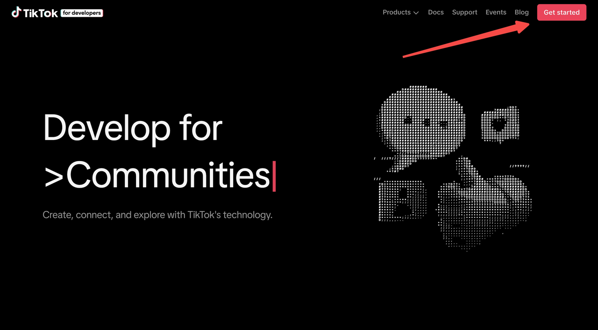

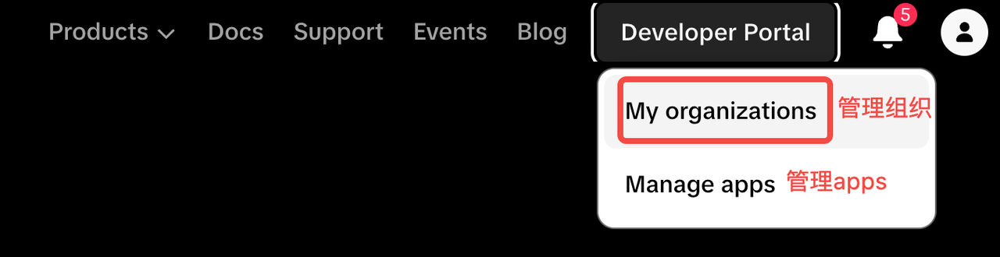

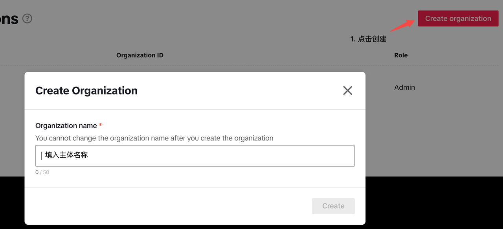

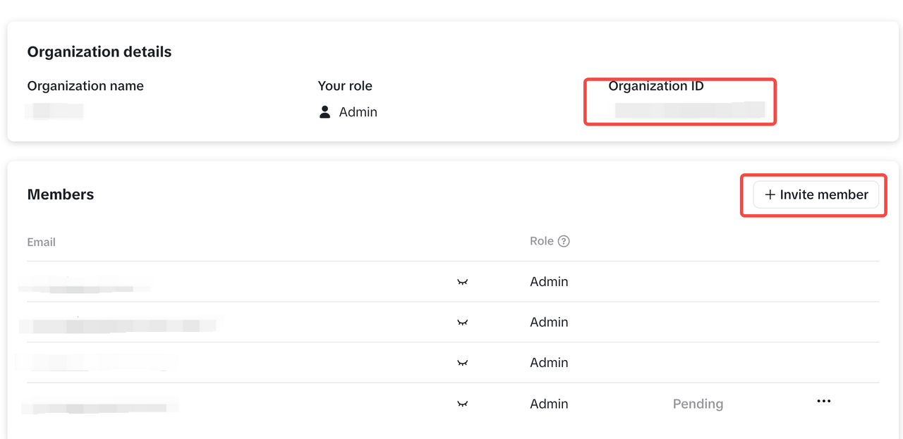

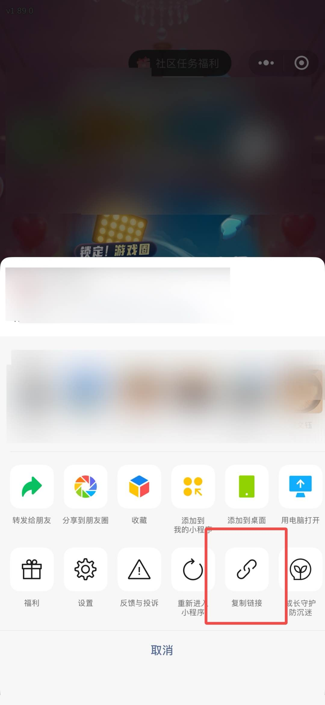

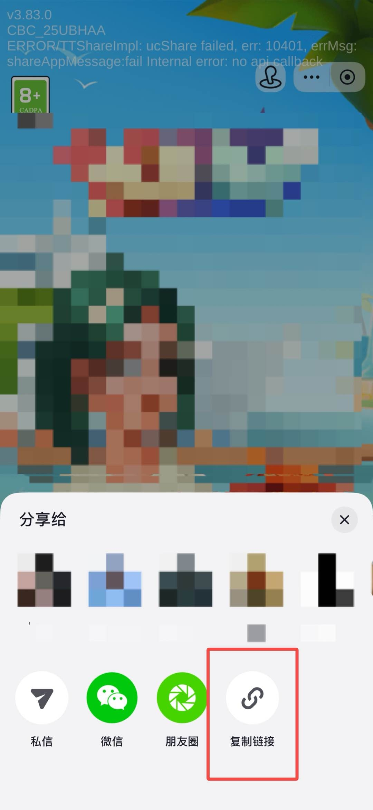


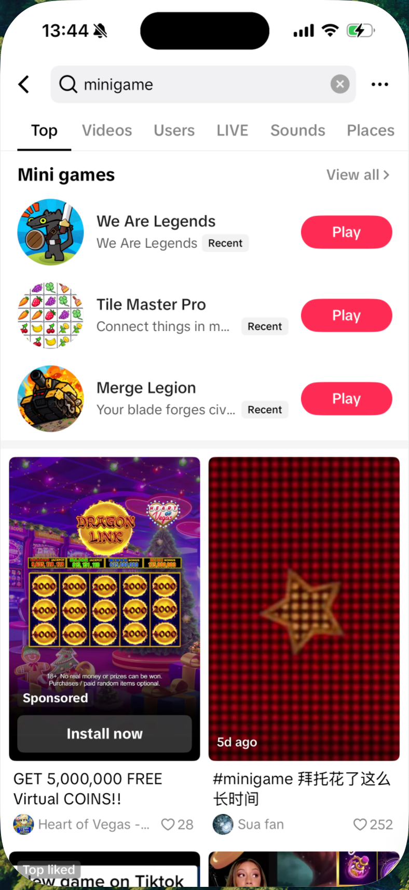

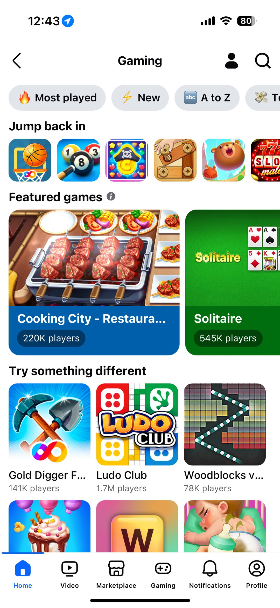

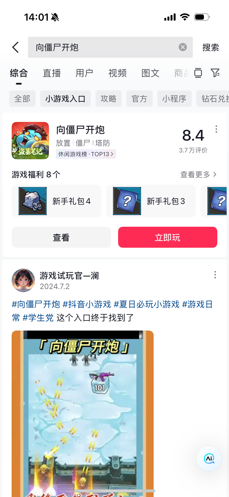

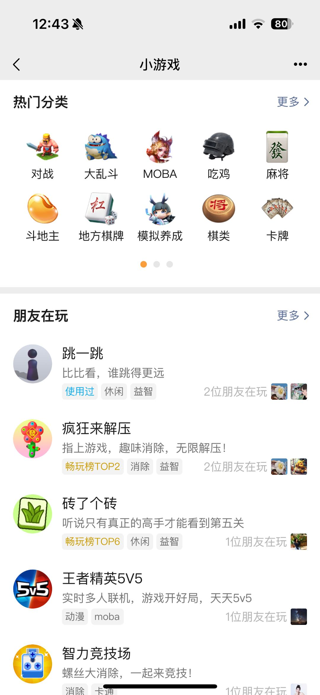

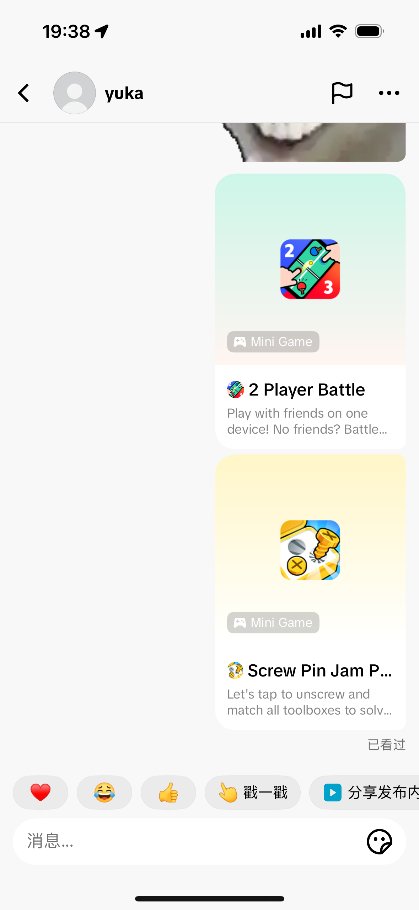

**[画板]**
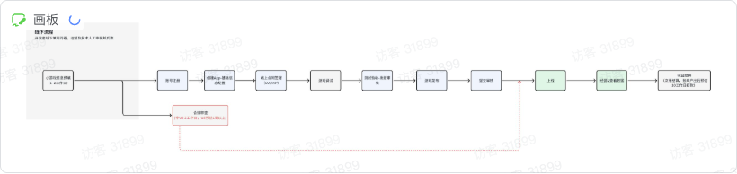

**[画板]**


**[画板]**
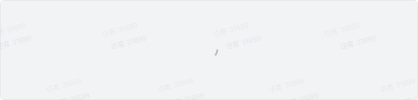

**[画板]**
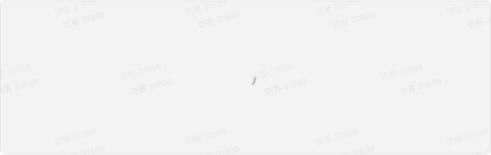

**[画板]**


**[画板]**
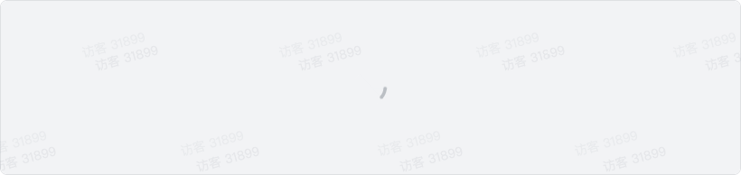

**[画板]**


**[画板]**
