1/27 Q1新品类！逆袭题材、齿轮玩法消耗破$X，首日回本！

12/22

优质案例//CaseStudy - 3.1 案例：益智 脑洞/找茬//3.1 Puzzle - Prank/tricky test

变现设计//Monetization - 3.2 
TikTok Mini Game Monetization变现设计

品类变现指南：1.1 
TikTokMiniGame品类变现指南 - 策略塔防//TikTokMiniGame Monetization Design - Strategy

🔤 >> English Version <<🔤

# 1. 🆕TikTok引入建议&优质案例

> 结论

> 1. 基于能快速回本的目的，尽可能在玩家首日进入游戏时提升观看广告的次数，游戏内至少需提供5个以上激励广告点位。
> 1. 将广告融入至游戏进程中的游戏更容易在首日得到高ROI；比如益智类游戏，玩家可通过反复游玩或动脑、寻求朋友帮助等方式过关；但模拟养成或策略类游戏通常依赖游戏内的道具、'运气'，所以后者更容易设计激励广告且更有概率使玩家观看广告。
> 1. 通过单局时长提升广告频次；比如塔防类游戏，由于单局时长至少2分钟以上，通过局内装备&道具随机性提升激励广告频次
> - 引入优先级：塔防/背包＞模拟养成/经营＞益智＞街机＞.io＞益智
> - 除已验证的品类&玩法，符合结论可延伸探索时间管理类的模拟经营游戏

从Tiktok小游戏的首日ROI数据来看，表现优秀的游戏分为以下三种品类：

- 益智类：Brian Puzzle Queen, Save the dog
- 策略类：Start With a Dragon, Forge of War, Gear Rivals
- 模拟类：Underdogs'Victory, Reborn Emperor

## 1.1 策略： 塔防 齿轮 背包

> - 齿轮：Q1新增齿轮玩法的游戏绝大多数在首日回本，且IPU至少10+；由于游戏单局时长2分钟+，齿轮玩法在Q1的新增次留、人均游玩时长均为大盘Top；
> - 塔防：传统塔防结合灵活变现模式，自Q4上线至今持续稳定，IPU次数超x次
> - 背包like：以背包玩法为主同时有主线并融合了多种副玩法，除IAA外，IAP在Q1有小幅提升。案例游戏生命周期已超6个月；
> - TikTokMiniGame品类变现指南 - 策略塔防//TikTokMiniGame Monetization Design - Strategy

#### ⚙️齿轮

核心机制：
关卡制，通过优化“齿轮”组合，提升自身的战斗力，进而解锁更多的关卡或奖励。

服务于变现的游戏设计，通过对局时长提升广告频次：在多款齿轮玩法中，有类似“体力”系统的设计，玩家需要消耗体力参与战斗，同时结合掉落的随机性，玩家会被引导、获得更多合适的装备或“齿轮”来提升战斗力；同时由于单局chapter通常花费时间高于普通一直关卡游戏，所以即使玩家只玩一局，观看广告次数至少10+

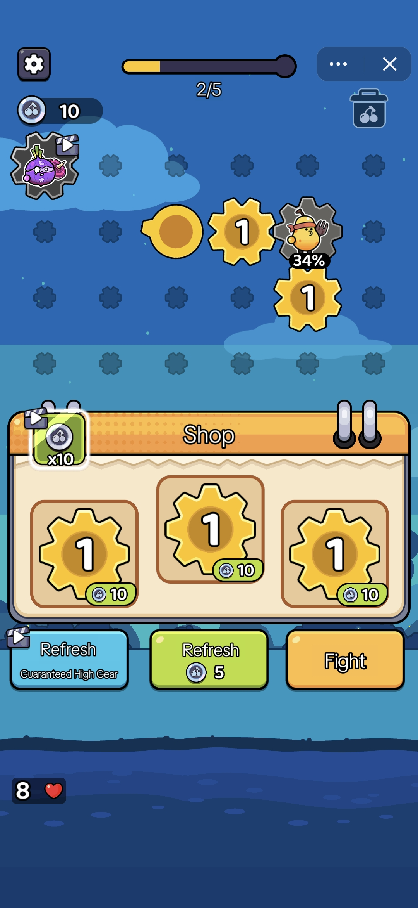

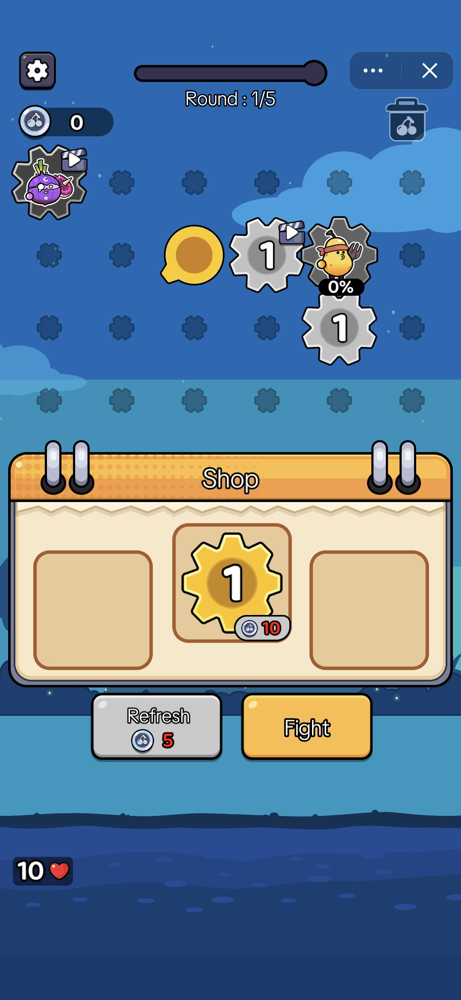

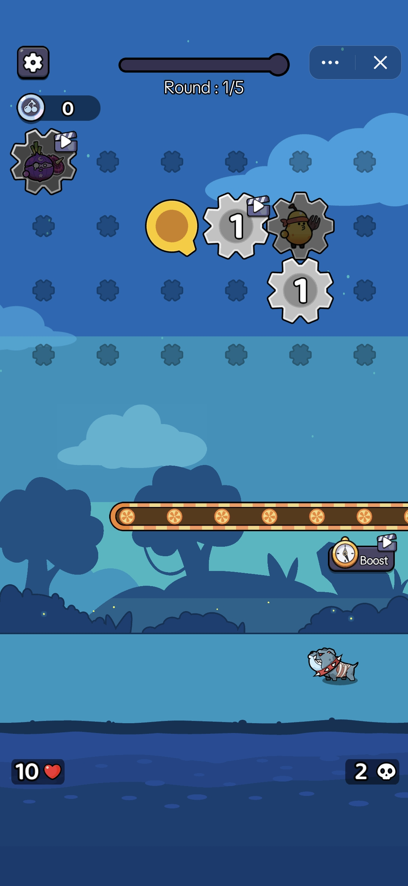

- 初始货币10r - 消耗初始货币购买齿轮 - 赢 - 获得货币 - 循环
- 当货币不足时、货币、额外道具均可供玩家作为胜利的广告选项

画风：线上齿轮类玩法美术风格各异，为适应Global Market，色彩饱和度较高，建议参考游戏A

变现：纯IAA；局内通过观看广告获得道具、refresh机会、体力（或食物）、临时增益；对局后观看广告获得金币服务于周边养成系统（虽然有周边系统，但建议变现放在局内）

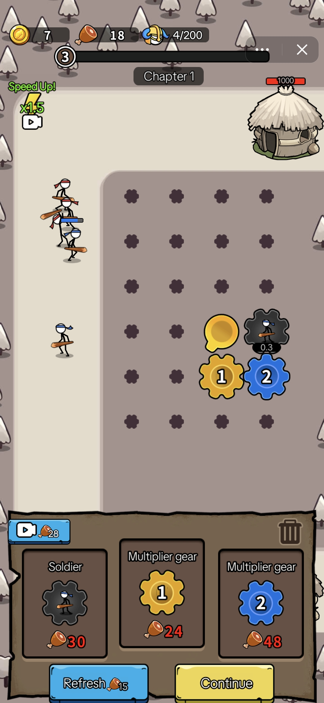

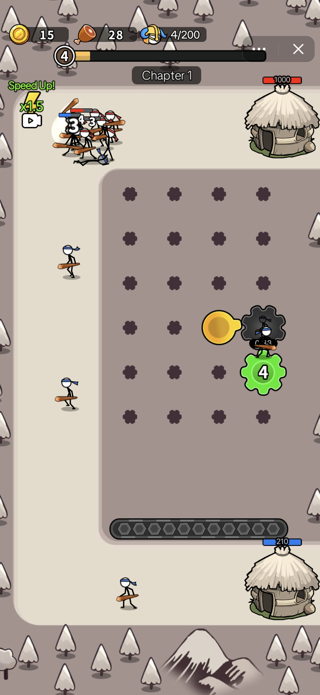

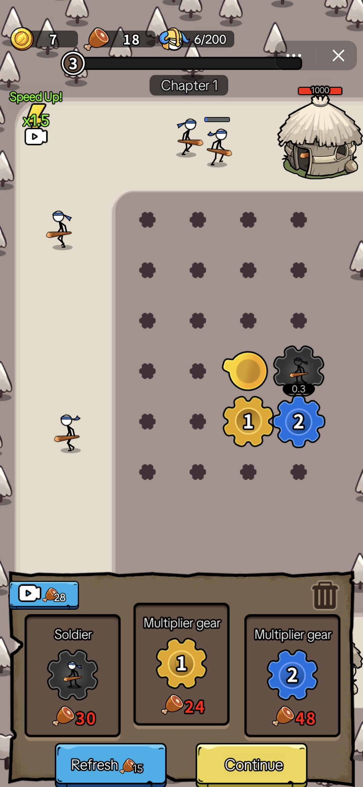

#### 🗼塔防

核心机制：关卡制，在有限时间内提升战力，抵御狼群

游戏设计：单局时长～2分钟，对局内在不观看广告的情况下无法赢得对局；局内提供加速及加🍗；加速为单次有效，🍗作为提升战力关键且唯一的手段，根据游戏内容进程（需求）、观看次数给予奖励；e.g. 第一次观看为刚需，第2次观看的奖励是第1次的1倍、第3次观看基本已经到对局尾且收益是第1次的3倍；这种符合用户游玩心理的节奏让玩家不看反而‘亏’了，增强了游戏的紧迫感，同时实现了有效的IAA变现

画风：界面简洁但精致，风格化卡通风格

变现：纯IAA； 通过‘体力（🍗）’、加速实现收益；局内广告点位较少，但阶梯式设计不仅刺激玩家同时也实现收益

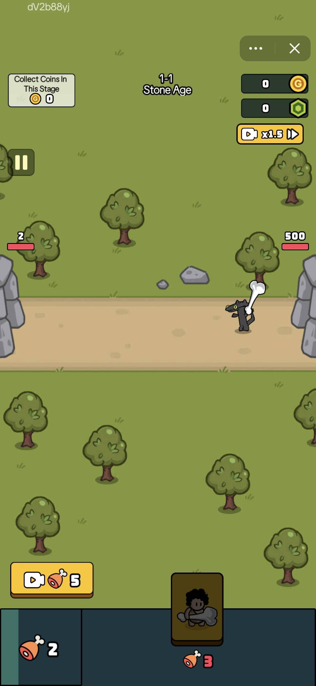

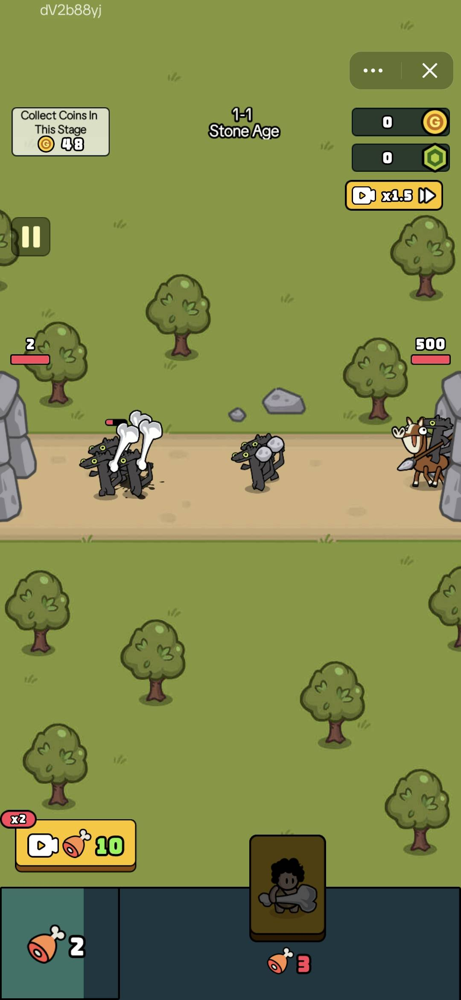

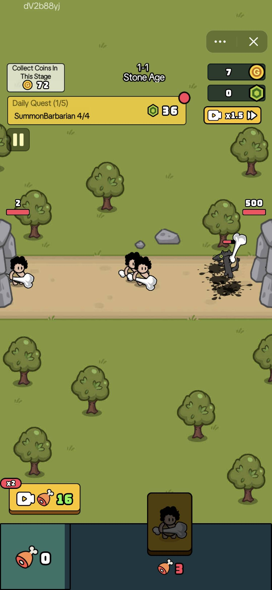

#### 🎒 背包like

核心机制：在有限的背包空间内合理摆放角色，通过角色、武器升级提升战斗力。

游戏设计：游戏整体设有'生命系统'，需要耗费体力才能进入核心玩法（背包），体力可以通过观看广告兑换，但次数有限，推动IAA和留存。对局中角色及武器的随机性刺激玩家不断推进进程，当1～3局之后，玩家想有更'爽快'的体验感必须开拓更多背包空间或roll到自己需要的武器和角色，推动IAA。除队列、角色养成周边系统；

画风：典型的全球发行游戏的设计样式：简洁、高饱和度；

变现：混合变现，IAA收入占90%以上。绝大部分可以通过IAA完成。分别在局外、开局前、对局内、对局后提供超过10个以上广告点位

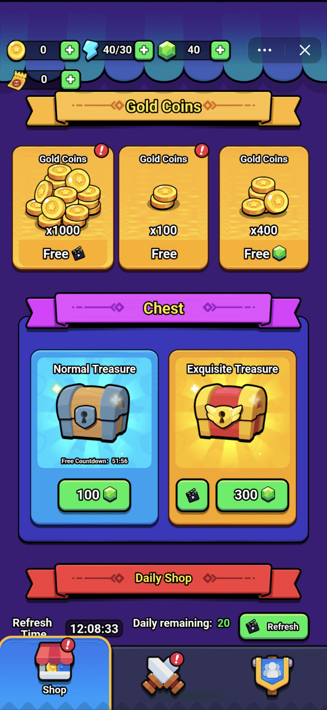

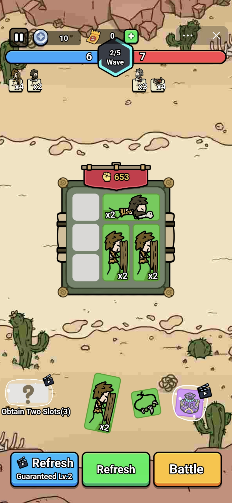

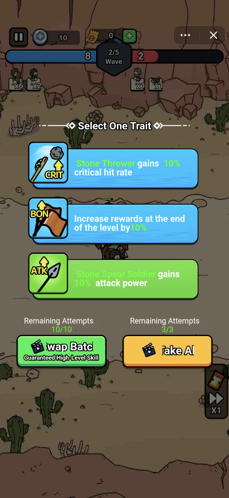

## 1.2 模拟经营： 逆袭题材（数值养成）

> - 代表案例

> 在数值养成玩法下，除皇帝题材、Q1新增逆袭题材，通过沉浸式主线剧情+目标+清晰地达成路径；逆袭题材消耗曾冲至Top且首日回本；

#### 🖱️数值 逆袭题材

- 游戏A逆袭则通过设定多个目标（collection）刺激玩家积累金币-招募-金币的循环；

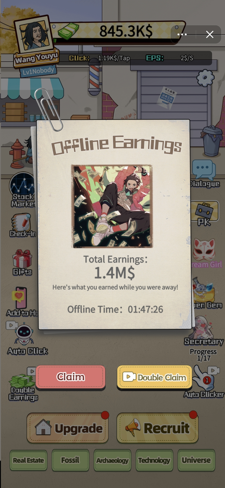

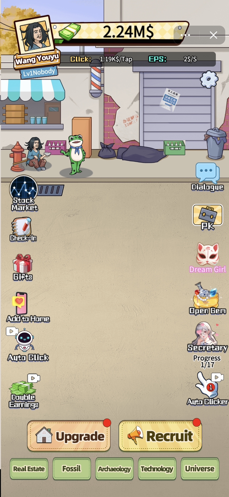

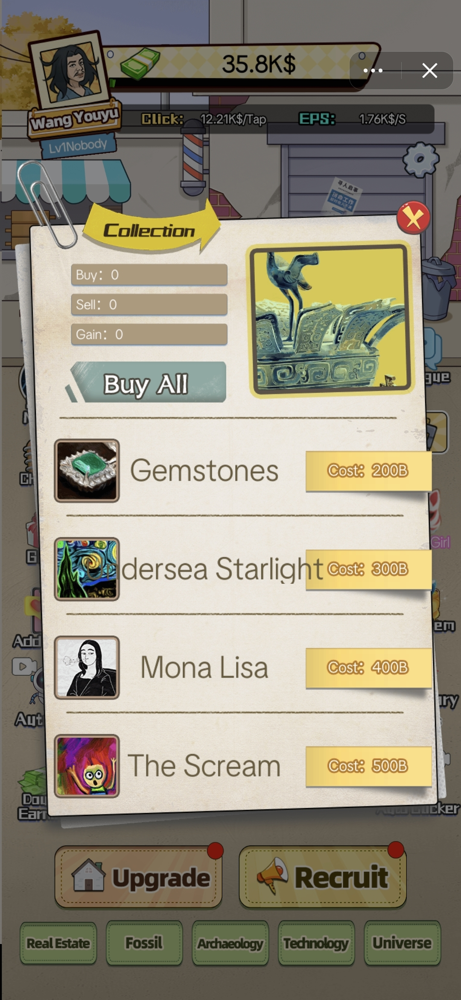

- 游戏B提供了大量可重复观看的广告位，多维度提升玩家体验；

两款游戏均设计了off line收益，游戏B（逆袭）新增及活跃的次留、7留均高于线上其他游戏。

美术：两款游戏的美术风格和UI设计都更符合中国审美习惯，但在Global Market视觉统一的美术风格也

变现：纯IAA；游戏A在主线提供玩家多个长线‘目标’及唯一达成手段（金币）；游戏B副玩法中大量可重复观看的广告位并能直接加速玩家达到游戏目的。

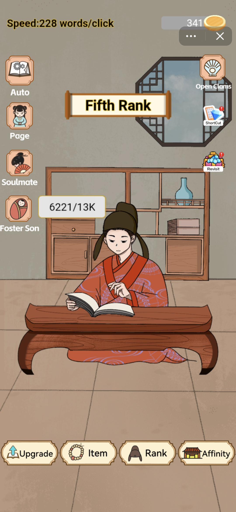

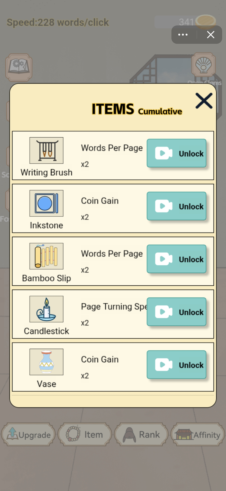

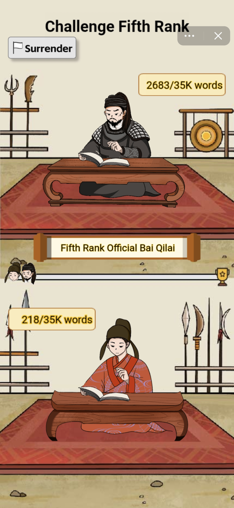

## 1.3 关卡益智：解谜/找茬

> - 代表案例：某益智解谜游戏

> 主营U.S地区，关卡制脑洞找茬游戏，女性用户占比70%，首日ROAS160%+

#### 🧠脑洞解谜

核心机制：关卡解谜

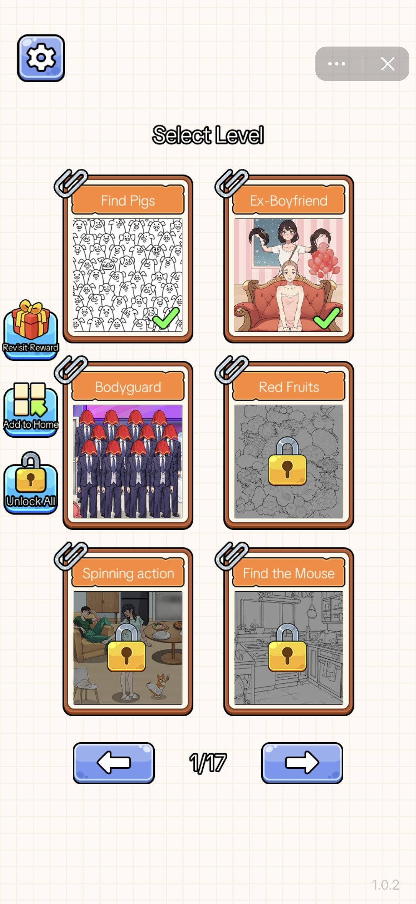

游戏设计：每一关为不同玩法的‘找茬’，比如找不同、选择、脑洞解谜等；玩家需要达成每关不同解谜任务

变现设计：标配的提示线索、加时长、解锁全部关卡；同时在每关结束弹插屏广告；在收入分布中，插屏广告有较大比例贡献，

美术: 均为2D日韩卡通；微恐风格广告素材在该品类下有较高转化率，可延伸至微恐题材找茬、解谜或特定背景条件下的解谜

## 1.4 更多品类引入建议

回顾Q3ROI较高的游戏发现，将激励广告融入至游戏深度、进度及相关系统和互动功中，对玩家来说打造了一个更加流畅的盈利循环；对开发者而言，不需要减轻广告点位只需要将其更合理至对应的主题中。将激励广告融入玩法之中，不是看广告可以获得什么，而是这个广告能让你在游戏中有更多/更好的游戏体验。

背包和养成经营类游戏给玩家明确的游戏目标、同时为玩家可达成提供了较多可选的方式，每一个方式都对应几个广告位，使首日IPU至少都在20以上。

关卡制游戏依赖于关卡堆叠、难度曲线，变现强依赖插屏广告，不建议在插屏广告上线前引入。

e.g.Royal Match已经有1万+个关卡且运营活动不断的情况下才能稳住收入

#### △ 策略 - 塔防

我蛮厉害的 疯狂防线

塔防+Roguelike

玩家需要在游戏中收集资源，获取装备，解锁全新的地图。游戏中提供多种道具并具有随机性，玩家可以根据需要选择使用，增加战术选择（广告点位）。

植物大战僵尸

玩家需要在不同游玩模式下，通过摆放各类道具抵御僵尸对局中，有限时间内玩家对道具（太阳、地雷、种子等）需求大，可以设计多样广告点位。

#### △ 策略 - 背包

Backpack Hero: Merge Weapon,Backpack Brawl

核心框架是花园like+靶心like，在背包管理之下，局内玩法将TD塔防、Rogue、二合三种已经成熟的玩法和热门元素融合到一起，带给玩家类似卡牌搭配、策略博弈的心流向爽感。

两款都以美国地区收入（>$20万）为主，俄罗斯下载量最高

背包玩法+PvP

#### △ 模拟经营- Simulation tycoon

Idle Lumber Empire: Tycoon  Pizza Ready！

Tycoon+模拟经营的玩法中，在特定主题背景下（农场、餐厅、石油）等场景下，将‘解锁点’设置为金币+广告，或在传输速度、增添/升级角色上，亦可与时间管理的玩法结合；可设计广告点位丰富且通常有较高游戏相对轻度。

#### △ 街机类 Acrade, .io

在2025年10月Top20中，除益智类、模拟类游戏外在榜的游戏类型

画风及玩法都很简单的多人游戏，节奏明快且注重动作的同时涉及很少或几乎没有开发角色或情节的。

#### 其他建议

- 除上述推荐品类外，手上有放置挂机类游戏也可作为Q4引入的备选品类，因放置挂机类游戏偏重度且有大量文本相较于其他品类接入及本地化成本更高，不做重点推荐。
- 具有实时对战玩法、社交依赖玩法的游戏亦可作为社交游戏引入，Q4将会在TikTok消息场景开放社交游戏入口。
- Sort, Screw,Block,Merge等关卡制brain puzzle（画线、找不同、三消、倒水等）在插屏广告上线之前不做为引入品类，首日难回本且有长期不回本风险。
- 11月、12月在美国有感恩节、黑色星期五、万圣节等当地节日及促进消费的节日；长线运营游戏中可补充对应节日的礼包或运营活动，同时期间的ECPM会比平日更高（类比国内618、双11）。

# 2. 全球休闲游戏行业动态

> 行业洞察

> - 2025上半年休闲游戏创造约200亿美元的收入（IAP120亿美元）；其中近72%来自益智游戏和博彩游戏，益智游戏仍然是主流休闲游戏，但接近一半为2020年前的老游戏。头部益智游戏引领市场，占休闲游戏收入60%以上；Sort、Screw、Block玩法占收入70%以上。
> - 第三季度上线游戏覆盖益智、放置、策略、模拟等主流品类；策略及模拟类游戏在首日ROI、留存等指标表现优于其他品类。区别于益智游戏依赖关卡推进，策略、模拟游戏将激励广告作为游戏进程推进的必选项，第四季度引入品类优先级：模拟养成/经营＞策略塔防/背包＞街机＞.io＞益智。
> - 11月TikTok小游戏将上线全新开发者入驻-上传-调试及发布流程，并全面启用NativeRuntime方案；同时，IAA新增插屏广告进一步提升游戏变现效率。

## 2.1 平台动态

| 平台 | 动态详情 |
| --- | --- |
| GooglePlay |  宣布将于2025年12月全面关闭Instant Game |
| Facebook |  8月，Facebook将全面引入zero permission solution并预计在2026年9月完成所有迁移和接入Important Changes to Web Games and Instant Games on Facebook 接入文档：Network Enabled Zero Permissions - Facebook Games - Documentation - Meta for Developers Zero permission主要是为了提升小游戏接入效率，预期提升2倍以上；同时减少关于数据共享的合规风险，未来将提供更多社交及其他features。 这个阶段相当于TikTok的H5方案向native runtime solution迁移；其最终目的是为了更效率的广告营销而精简Meta旗下产品相关资源（e.g. instagram和Facebook Shop也做了结账系统的调整）  |
|  |  Reddit在今年3～8月逐步在首页侧边栏目开放' games on reddit'，大概在9～10月份全量。目前游戏储备约百款左右；  Reddit通过发起dev fund获得游戏，并以此为开发者提供收益，目前游戏内无变现。  |

平台

动态详情

- 已有百万DAU游戏Sword and Super,30万订阅游戏Honk
- Reddit的小游戏延续其社区属性，r/gamesonerddit的社区主页作'游戏中心'，用户可以通过社区feed内的post进入游戏或加入游戏自己的社区。post由玩家分享或开发者发布，这也是除主页侧边栏之外主要的用户来源。
- 每个游戏都有自己的社区，开发者可自行运营包括公告、活动等平台常规能力

目前全部都是单机；有大厂参与的游戏预计可能有采买；游戏板块上线侧边栏后遭到部分用户吐槽

Reddit

## 2.2 市场趋势

- 益智游戏仍然是主流休闲游戏

2025年上半年，全球休闲游戏收入同比增长0.8%，下载量增长5.8%。在全球范围内创造了约120亿美元的IAP收入；其中近72%来自益智游戏和博彩游戏，加上模拟游戏三个品类贡献了 80%的市场收入。

同时，在IAA收入上，贡献最多的国家是US、RU和JP（both IOS and Android）。

根据历年IAA及IAP收入占比逐渐趋向55开，当前可根据6:4-IAP:IAA

在2025年上半年收入最高的100款休闲游戏中，有41款博彩游戏，32款益智游戏；前 100 名中近一半的游戏是在2015 年至 2020 年期间发布的， 11% 的游戏来自近2023-2025 年，老游戏在持续稳固地位并寻找新的增长和盈利点。

- 三消是规模最大、最难进入的游戏类型之一

在益智游戏中，三消游戏贡献了所有益智类游戏超过一半的收入，超 27 亿美元，安装量～ 3.95 亿，是规模最大的游戏类型之一。尽管下载量下降了 17%，但三消在 2025 年上半年的收入仍同比增长 7%。主要来源于Royal Match, Candy Crush，两款游戏占了三消品类超50%以上收入，去掉这两款，三消品类收入几乎没有增长。

当前，三消仍然是最难进入的游戏类型之一，成功率仅为 1.4%，上半年只有3款游戏成功。Family Farm Match，Puzzle SEVENTEEN，君のことが大大大大大好きな100人の彼女ビビーン!!とパズル。三款成功的游戏中，两款来自IP热门IP衍生。

成功率：在6个月内至少一次月收入>$100k

- 3D Match热度消退

2025年，3D Match收入下降了12%（1.93亿美元），下载量跌34%至4900万次，Match Factory!单款游戏占品类56%收入，～1900万美元/月

- 爆发增长Screw, Sort, and Block Puzzle

2025年上半年，这三个游戏类型共计推出了超过2500款新游戏；Sort下载量增长14%，block增长+71%，各推出了1000多款新游戏；Screw Puzzle增长27%，增加了376款新游戏；三个类型收入倍数增长，其中Block Puzzle翻了12倍

## 2.3 海外Top品类动态及分析

### 2.3.1 益智类游戏动态

- 头部益智游戏lead the market

2025年第三季度休闲游戏收入对比2024年当季同比增长114%，但大部分来自老游戏。头部游戏保持稳定增长的趋势，新游戏数量比上一季度少。收入方面，益智游戏收入占比60%以上（第二季度超50%），其次是街机游戏32%，最后是模拟类游戏占比2.3%的，模拟游戏中，Dinosaur Universe和Dreamy Room在Q3收入都过300万美元。

Top10 收益游戏细分为：

- Block Puzzle: Color Block Jam, Crowd Express: Boarding Puzzle
- Screw Puzzle: Screwdom, Screw Sort Puzzle: Pin Jam 3D
- Sort Puzzle: Knit Out, Hole People, Coin Sort
- Arcade: All in Hole, Pocket Champs, Mob Control

### 2.3.2 Top玩法分析

下载量及收入数据仅取GooglePlay&AppStre

#### Sort：Coin Sort

Coin Sort 在三个月内月收入增长了9倍，跻身排行榜前十。游戏由曾推出过Match 3D和Hexa Sort等热门休闲游戏的 Lion Studios 工作室开发。第三季度收入540 万美元，下载量480 万 ，主要营收来自US。

Coin Sort对热门的“水排序”机制进行了重新设计，增添了随机性，通过融合机制和受2048启发的无限扩展机制，进一步深化游戏核心，使游戏玩法保持开放，挑战性不断提升。

核心机制：对金币进行分类和合并即可清空棋盘。

玩法：每次点击“发牌”按钮都会随机放置一组新的金币，

变现：激励广告精准：奖励翻倍，获得临时无限生命，解锁活动权限。

运营：提供每日挑战和限时竞速活动，在设定的时间内加速玩家的进度。这些竞赛活动通过营造紧迫感并增加新鲜感，有效吸引玩家日复一日地回到游戏。

限时竞速活动：竞速模式已成为混合休闲游戏领域最热门的运营手段之一。2025 年上半年，超过 60% 的混合休闲游戏都采用了这种机制。

#### Block：Color Block Jam

Color Block Jam是休闲游戏第三季度收入Top1，共收入3300 万美元，下载量1860 万次。62%的收入来自US，20%下载来自印度、14%来自U.S。

核心机制：将方块移动至对应颜色进行消除金；关卡制。

游戏设计：优秀的难度曲线和时间限制。玩家在第一局游戏中可以持续20-30分钟。从20-25关开始，通关时间变短缩短，挑战难度上升，push玩家使用道具。同时，游戏还设有有限的生命值系统，生命值会随时间重置，需使用游戏货币补充。

变现：早期关卡无广告，玩家轻松上手；横幅广告和插屏广告会在后期出现。

获客：除了高预算的推广活动成功吸引付费用户外，Color Block Jam在社交媒体上有大量用户自发的游戏片/攻略。

#### Screw：Screwdom

Screwdom第三季度收入2900 万美元 ，下载860 万次，48%收入来自U.S。目前，是市场上最赚钱的螺丝游戏。

核心机制：将所需螺丝拧出并整理

游戏设计：从 2D 转向了 3D。通过 3D 增添视觉和机制上的深度，玩法更具有挑战性和沉浸感。

变现：复杂的关卡需要 5 到 15 分钟才能完成，时间投入使关卡失败的成本变高，进一步push玩家付费而非重新开始，金币包是游戏的主要盈利模式。

运营：通过连续不断的运营活动取代每周任务；玩家的每周目标转变为活动的阶段性目标。9月推出的Screwdom奖杯赛和篮球联赛带动了本季度收入的最高增幅，接近15%。

#### 10月增长趋势

pizza ready   类型：Tycoon+

第三季度收入：超500万美元 | 下载量：1100万/per month

广告:去掉了常见的"激励广告"弹窗,将视频奖励融入到游戏进程中。打造了一个更加流畅的盈利循环，减轻了广告带来的干扰。对于开发者而言,这说明即使必须频繁投放广告,将其融入游戏主题也能提升用户参与度。

比如：经营这家店，只有玩家一个人是不可能的，必然要看广告招募员工和upgrade:(

Mob Control  类型：Arcade+

第三季度收入：650 万美元 | 下载量：1800 万 | D0ROAS约150%

游戏设计：简单易上瘾的核心循环辅以更深层次的副玩法。通过提供快速战斗和长期目标(升级、活动、部落)实现较高留存率(第七天约为15%)。年收入超2亿美元并仍在持续增长。

# 3. 全球休闲游戏用户画像及游戏趋势

## 3.1 🇮🇩Indonesia

用户画像：学生与自由职业者为主，收入水平较低，大部分玩家（69%）的月收入低于2700元人民币，其中约31%的玩家月收入在900-1800元人民币之间。

设备及网络：手机设备大多为2020年以前，ROM绝大多数都是128G以内。玩吃性能的游戏需要贵一些的手机所以印尼的二手手机市场也很发达。但由于印尼对手游的热情较高，所以模拟器玩手游在印尼是普遍现状。

📈10月 Top Free

💸10月 Top Grossing

同时印尼用户大部分人单月流量在3G以上，大部分人会买流量包（包夜、包周末），长线运营的游戏在做好复访引导的情况下可以考虑设计off line 收益。

游戏习惯：手游为主，67%的玩家每天都会玩手游，56%的玩家在6个月内会至少尝试1～3款新游，27%的玩家会尝试4～6款。

偏好为数值成长、外观付费，超过32%的用户通过看广告获得激励；55%以上玩家的动机是完成任务列表中的tasks或达成成就。

## 3.2 🇯🇵Japan

用户画像：日本移动游戏市场规模约 83.3 亿美元。手机是最主要游戏平台，16–29 岁 玩家渗透率最高，约 90% 玩手游。手游性别差距逐年缩小～5:5.

设备：Android 占 55.1%，iOS 占 44.1%。但在游戏消费中，iOS 用户贡献约 68% 收入，显著高于 Android 用户。日本用户以高端机为主，设备更新快。

游戏习惯：RPG、收集类与二次元题材为主导品类，前 100 收入手游中 38% 为 RPG。日本用户偏好角色成长、抽卡、外观付费。

📈Top Free

💸Top Grossing

广告变现比发展中市场低，但广告仍存在于轻度／放置类游戏中。广告曝光更注重“品牌感”和“角色世界观”呈现，而非纯激励型。

活动驱动强烈，节庆（如黄金周、开学季、情人节）常伴随大规模充值活动。

在Q3中，简单的益智游戏在日本地区target到较多画像为30-45+的中老年女性。

## 3.3 🇺🇸the U.S

📈Top Free

💸Top Grossing

用户画像：约 65% 的成年人玩手游，其中 45% 每周至少玩一次。性别比例相对均衡，女性约 53%，男性约 47%。主力年龄段为 18–34 岁，为手游的核心消费群体。

设备：手机是主要游戏设备，约 70% 的美国玩家以手机为主。iOS 占 56–60%，Android 占 40–44%。iOS 用户在消费贡献中领先，尽管 Android 下载量更大。

游戏习惯：主要付费动机是解锁内容、加速成长和个性化外观。广告仍是主要变现方式之一。激励广告普遍被接受，尤其在休闲类游戏中，用于补充非付费用户变现。玩家的主要动机是“放松与娱乐”以及“打发时间”。

# 4. 引入规范

## 4.1 入驻DvePortal

1. 注册及验证

在TikTok开发者后台注册且完成business认证，并遵循TikTok开发者相关协议及社区协议。

相关协议

- Developer Guidelines
- Developer Terms of Service
- Developer Data Sharing Agreement
- Community Guidelines
1. 合规审查

为规范经营，开发者需完成合规审查及U.S launch审核（如需发美区）

## 4.2 准入资质：开发者&游戏

1. a.
具备合法的海外经营主体（若需在U.S地区经营，必须为非香港主体）
1. b.
具备游戏投广经验
1. a.
棋牌类、捕鱼类、网赚类及涉赌风险小游戏；纯UGC内容小游戏；与已上线产品场景和内容高度一致的游戏暂不接入，其余游戏可依照规范接入。
1. b.
游戏必须为Cocos开发的竖屏游戏，整包大小不超过 30MB，主包大小不能超过 4MB。[required]
1. c.
在第四季度，品类优先级为模拟养成、背包、塔防＞超休闲（街机、益智、三消、合成等）[optional]

## 4.3 游戏品质

Full Version&Best Practice： Quality of a mini game_Gameplay

- 游戏必须清晰、准确地呈现其类型和游戏体验。
- 玩家有可以达成的的明确目标。
- 游戏易于学习和理解（15秒内），有新手引导，或一目了然、有非常清晰的帮助功能。
- 游戏起始、进展都清晰且易于理解。
- 游戏的标题和视觉素材应始终与游戏的实际内容相符，确保玩家不会被误导。
- 按钮都有清晰的标签，以指示如何操作。
- 按钮的尺寸设计并非为了鼓励广告或其他行为。
- 按钮不会设置延迟来迷惑用户或鼓励其他行为。
- 语言正确清晰，翻译得当，或者合理地利用通用图形提示。
- 在不同语言版本中，没有typos
- 游戏过程中，玩家不会因'地域文化'而阻碍游戏进程。
- 多地区发布前自查是否有文化冒犯

## 4.4 游戏变现

👉变现策略：
TikTok Mini Game Monetization变现设计

#### IAA

Full Version&Best Practice： Quality of a mini game_ IAA Monetization

- 激励广告价值需清晰可见，在观看广告之前玩家知情且需告知玩家可获得的奖励
- 不会因不看广告给玩家带来负向体验
- 激励广告融入至游戏深度、进度及相关系统和互动功能中 [optional]
1. 广告示例

我们将广告变现分为了几个类别，以下示例是一些最常用的选项。期待开发者有更多设计合理且创新的激励广告。

| 广告类型 | 描述 |
| --- | --- |
| 插屏广告 | 在关卡结束、复活或重开前、主菜单、场景切换、加载页面时播放广告。建议节奏为每2～3局播放一次，短时循环玩法（30s）建议每3～5局播放一次。需要有冷却时间（至少30s） Will be available in mid Nov... |
| 插屏激励 | 在插屏广告播放完毕之后给予用户小额激励。 |
| 复活 | 观看奖励视频以复活/返回游戏（不丢失进度）。 |
| 关卡跳过 | 观看奖励视频以跳过当前关卡并继续前进。 |
| 提示 | 观看奖励视频以在当前关卡中获得提示（帮助玩家在卡住时脱困）。 |
| 属性提升 | 观看奖励视频以提升属性（如生命值、伤害、魔法值、耐力、护盾等）。 |
| 加速游戏 | 观看奖励视频，以加速整个游戏或特定技能/动作。 |
| 额外能力 | 观看奖励视频以获得新的或特殊的能力/物品。 |

广告类型

描述

插屏广告

插屏激励

复活

关卡跳过

提示

属性提升

加速游戏

额外能力

游戏内经济

观看奖励视频可获取的内容也能通过游戏的内部经济系统获得。

倍增奖励

观看奖励视频，可将您获得的金币/点数（无论是在游戏过程中还是离线收益）翻倍（例如x2）。

直接金币解锁

观看奖励视频以解锁特定数量的金币/积分。

功能解锁

观看奖励视频以获取新功能，这些功能可提升游戏体验，如环境变化、音乐/歌曲、新的 UI 配色方案等。

皮肤

观看奖励视频，即可为角色或武器获取一个或多个外观元素。这可以通过直接解锁（1个视频 = 1个奖励），或渐进式解锁（多个视频 = 1个奖励）来实现。

#### IAP

在第三及第四季度，IAP收益占比极低；开发者可对IAP或混变游戏进行更多探索。

1. 设计原则

| 要求✅ | 禁止❌ |
| --- | --- |
| 价值清晰可见，玩家必须立刻明白买了能获得什么、解决什么问题。 | 不强迫购买（例如“必须买体力才能继续”） |

要求✅

禁止❌

不买也能玩，但买更爽

不滥用弹窗（每次登陆都弹礼包）

透明展示价格、收益、周期与退款政策。

不误导（展示奖励与实际购买不符）

分层次定价 [suggestion]

不破坏平衡（氪金玩家碾压一切）

1. 常见类型

| 内购类型 | 描述 |
| --- | --- |
| 道具包 | 一次性购买：体力、金币、复活、加速器等 |

内购类型

描述

道具包

永久解锁

去广告、解锁关卡、买皮肤

月卡/季票/通行证

日常返利+特权

新手礼包/成长礼包

新手引导期低价促成首购

限时活动礼包

借助节日/版本活动推出

## 4.5 其他

1. 接入方案：TikTok全面接入native runtime方案（cocos开放支持, Unity游戏内测邀请制），H5版本相关API将不再维护
1. 开发者后台：11月中旬起，将启用新的上传-调试-发布流程，开发者可以更效率地在TikTok发小游戏；同时，开发者需在dev portal完成Know Your Business的认证，否则无法发布及结算。

♪(*^^)o∀ - 到底了 - *∀o(^^*)♪

# TikTok Introduction Recommendations &  Global Casual Game Trends

Monetization - 3.2 
TikTok Mini Game Monetization变现设计

Monetization by Category：1.1 
TikTokMiniGame品类变现指南 - 策略塔防//TikTokMiniGame Monetization Design - Strategy

# 1. Cases Study & Introduction Recommendations

> Conclusion

> 1. To maximize early-day ROI, games should encourage players to watch ads as soon as they enter the game on Day 1. Ideally, a game should provide at least five rewarded ad placements within the gameplay loop.
> 1. a.
For puzzle games, players can complete levels by replaying, solving puzzles, or seeking help from friends.
> 1. b.
In contrast, simulation/strategy games often rely on in-game items or elements of chance, making them better suited for designing rewarded ads and increasing the likelihood that players will watch them.
> 1. Increasing ad frequency through session duration: For example, tower defense games, with each session lasting at least 2 minutes, can boost the frequency of incentive ads by using random in-game equipment and item mechanics.
> - Q4 introduction priority by genre:
Strategy/Tower Defense/Inventory > Simulation/Management >  Puzzle>Arcade > .io
> - In addition to already validated categories and gameplay, time management simulation games that fit these conclusions could be a potential catogary.

Based on Day-1 ROI data from TikTok mini-games, the top-performing titles fall into the following three categories:

- Puzzle: Brian Puzzle Queen, Save the dog
- Strategy: Start With a Dragon, Forge of War, Gear Rivals
- Simulation: Underdogs'Victory, Reborn Emperor

## 1.1 Strategy: Tower Defense, Gear, Backpack

> Representative Cases

> - Gear: Most games with the new gear gameplay introduced in Q1 achieved ROI on the first day, with an IPU of at least 10+. With session lengths over 2 minutes, gear mechanics ranked top in Q1 for new retention rates and average playtime per user.
> - Tower Defense: Traditional tower defense games with flexible monetization have remained stable since their Q4 launch, with IPU counts exceeding X.
> - Backpack-like: Focused on backpack gameplay, combined with the main storyline and various sub-gameplay features. Aside from IAA, IAP saw a slight increase in Q1, and the game's lifecycle has surpassed 6 months.

#### ⚙️Gear

Core Mechanism: The game operates on a level-based system. By optimizing the combination of "gears," players can enhance their combat power, thereby unlocking additional levels or rewards.

Game Design: The game design is geared towards monetization, utilizing the increased session duration to boost ad frequency. Among various gear mechanics, a "stamina" system is employed, where players must consume stamina to engage in battles. Additionally, the randomness of item drops guides players to acquire more suitable equipment or "gears" to improve their combat power. Given that each chapter typically takes more time than regular levels, even if players only engage in a single chapter, the number of ads viewed will exceed 10 per session.

- Initial Currency: 10R
- Currency Consumption: Players use the initial currency to purchase gears.
- Winning: Players earn currency upon victory, completing the cycle.

- When Currency is Insufficient: Both currency and additional items are available as options for players to watch ads for victory.

Art Style:  higher color saturation is recommended. It’s suggested to reference Game A for inspiration.

Monetization: Pure IAA (In-App Advertising). Players can watch ads to obtain items, refresh opportunities, stamina (or food), and temporary boosts. Players can watch ads to earn coins, which support the peripheral development system. Although there is a peripheral system in place, it is recommended to focus monetization within the game loop.

#### 🗼Tower Defense

Core Mechanism: The game operates on a level-based system. Players must enhance their combat power within a limited time to fend off wolf packs.

Game Design: Each round lasts approximately 2 minutes. Without watching ads, players cannot win the round. In-game, acceleration and "chicken legs" (🍗) are provided. Acceleration is a one-time effect, while 🍗 serves as the critical and sole means to increase combat power. Rewards are given based on gameplay progression and the number of ads watched. For example:

- The first ad watched is a basic requirement.
- The second ad provides a reward that is double the first.

- By the third ad, the round is near its end, and the reward is three times that of the first ad.

This pacing aligns with the player's mindset, where not watching ads feels like a loss, increasing the sense of urgency and enhancing the overall gaming experience. Additionally, this system enables effective IAA monetization.

Art Style: stylized cartoon aesthetic.

Monetization:
 Pure IAA (In-App Advertising).

- Players earn rewards through "stamina (🍗)" and acceleration. In-game ad placements are limited, but the tiered design not only stimulates players but also drives monetization.

#### 🎒 Backpack

Core Mechanic:

- Players strategically place characters within limited backpack space, upgrading characters and weapons to improve combat effectiveness.

Game Design:

- Both games implement a life/stamina system, requiring energy to enter the core inventory gameplay.

- Energy can be replenished by watching ads, though the number of uses is limited, effectively driving IAA revenue and retention.
- Randomization of characters and weapons during battles encourages players to progress further, as after 1–3 rounds, they seek a more satisfying experience by expanding backpack space or rolling desired characters/weapons, further promoting ad engagement.
- Additional mechanics include queue management and character progression systems.

Visual Design:

- Both games feature typical global-release design: clean UI, high color saturation, and visually distinct art styles. Game 1 has animation-like characters, as its launched in JP only.

Monetization:

- Hybrid monetization, with IAA accounting for over 90% of revenue.
- Players can access 10+ ad placements per session, appearing outside of matches, pre-match, during gameplay, and post-match, allowing most revenue to be generated through IAA.

## 1.2 Simulation Management: Reversal Theme with Numerical Progression

> Representative Cases:
In the numerical progression gameplay, aside from the emperor theme, the newly introduced reversal theme in Q1 has gained significant traction. Through immersive main storyline, clear objectives, and well-defined achievement paths, the reversal theme managed to reach top positions and recouped costs on the first day.

#### 🖱️Numerical ：Reversal Theme

- Game A (Reversal Theme): The game sets multiple goals (collections), stimulating players to accumulate gold—recruit—gold in a cyclical manner.

- Game B: Offers numerous repeatable ad placements, enhancing the player experience across multiple dimensions.

Both games feature offline earnings, and Game B (Reversal Theme) has seen increased retention, with both day 2 and day 7 retention rates higher than other online games in its category.

Art Style: Both games’ art styles and UI designs are more aligned with Chinese cultural preferences. However, for the global market, the visual style is unified, ensuring broader appeal.

Monetization:
 Pure IAA (In-App Advertising). Game A, Players are provided with multiple long-term goals in the main storyline, with the only means of achievement being gold. Game B, Features a large number of repeatable ad placements in secondary gameplay, enabling players to directly accelerate their progress towards in-game objectives.

## 1.3 Puzzle Levels: Puzzle Solving / Spot the Difference

> Representative Case:
A puzzle-solving game primarily targeted at the U.S. market. This level-based "spot the difference" game has a 70% female user base and achieved a first-day ROAS (Return on Ad Spend) of over 160%.

#### 🧠Brain Puzzle

Core Mechanism: Level-based puzzle-solving

Game Design: Each level features a different type of "find the difference" puzzle, such as finding differences, selection puzzles, brain teasers, etc. Players need to complete different puzzle-solving tasks in each level.

Monetization Design: Standard features include hint clues, time extensions, and unlocking all levels. Additionally, interstitial ads are shown at the end of each level. Interstitial ads contribute a significant portion to the revenue distribution.

Art Style: Both games feature 2D Japanese/Korean cartoon styles. Ad creatives with a mild horror theme tend to have a higher conversion rate within this category. This approach could be extended to mild horror-themed "spot the difference" games, puzzle-solving games, or puzzles set in specific contextual backgrounds.

## 1.4 Q4 Introduction Recommendations

- Integrating rewarded ads into core gameplay, progression systems, and interactive features creates a smoother monetization loop for players. For developers, the focus is not on reducing ad placements, but on embedding them meaningfully within the game theme.
- The principle is: rewarded ads should enhance the gaming experience, rather than simply provide a reward. Ads become part of gameplay progression, offering players more or better ways to engage with the game.
- Inventory and simulation/management games: Provide players with clear goals and multiple ways to achieve them. Each method can be linked to several rewarded ad placements, ensuring Day-1 IPU (in-play usage) reaches 20+.
- Level-based games: Depend heavily on level stacking and difficulty curves. Monetization is strongly dependent on interstitial ads, so it is not recommended to introduce these games before interstitial ads are fully available.

Example: Royal Match maintains stable revenue only after building 10,000+ levels and continuously running live events.

### △ Strategy – Tower Defense

I'm quite awesome (CN), Crazy Defense Line

Tower Defense + Roguelike

- Core Gameplay: Players collect resources, acquire equipment, and unlock new maps.
- Mechanics: Multiple items are provided with randomized effects, allowing players to choose their use strategically, which naturally supports rewarded ad placements.

Plants vs. Zombies

- Core Gameplay: Players place various defensive items across different modes to repel zombie waves.
- Monetization Opportunity: During limited-time battles, there is high demand for resources (e.g., sun, mines, seeds), allowing for diverse ad placement opportunities without disrupting gameplay.

### △ Strategy – Inventory / Backpack

Backpack Hero: Merge Weapon,Backpack Brawl

- Core Framework: Combines garden-like and target-like mechanics, integrating tower defense (TD), roguelike, and merge systems under an inventory/backpack management structure.
- Gameplay Experience: Offers players a card-combination and strategic decision-making flow, balancing tactical planning with satisfying in-game feedback.
- Market Performance: Both games primarily generate revenue from the U.S. (>$200,000 each). Highest download volumes are observed in Russia.

### △ Simulation / Tycoon

Idle Lumber Empire: Tycoon  Pizza Ready！

- Core Gameplay: In Tycoon + simulation/management games, players operate within specific themed environments such as farms, restaurants, or oil fields.
- Monetization Integration: Unlock points can be tied to coins + ads, or linked to transfer speed, adding/upgrading characters, and time-management mechanics. This design allows for numerous ad placement opportunities, which are generally well-accepted by players due to the relatively casual gameplay pace.

### △ Arcade / .io

- Overview: In October 2025 Top 20 rankings, aside from puzzle and simulation games, Arcade and .io titles were the other prominent genres.
- Gameplay & Art Style: These are simple, fast-paced multiplayer games with minimal character development or storyline.
- Core Features: Focused on quick action and rhythm, designed for immediate player engagement rather than long-term narrative or progression systems.

### Other Recommendations

- In addition to the recommended genres, idle/AFK games can be considered as backup options for Q4. However, since these games are more complex and text-heavy, they entail higher integration and localization costs compared to other genres, so they are not the primary recommendation.
- Games with real-time PvP or social-dependent mechanics can also be considered as social game introductions. In Q4, TikTok will open a social game entry point within messaging scenarios.
- Level-based brain puzzles (line-drawing, spot-the-difference, match-3, water-sort, etc.) should not be introduced before interstitial ads are available, as they are difficult to recoup on Day 1 and carry long-term monetization risks.
- In November–December, local events such as Thanksgiving, Black Friday, and Halloween present high-spending opportunities.
- Long-term live-operation games can leverage seasonal gift packs or event campaigns, as ECPMs during these periods are higher than normal.

# 2. Global Casual Game Industry Trends

> Summary

> - In the first half of 2025, the global casual game market generated approximately $20 billion in revenue, including $12 billion from in-app purchases (IAP).Nearly 72% of this revenue came from puzzle and casino games, with puzzle games remaining the dominant subgenre. However, nearly half of the top-performing puzzle titles were released before 2020.Top puzzle games continue to lead the market, accounting for over 60% of total casual game revenue. Among puzzle mechanics, sort, screw, and block types contribute to more than 70% of the genre’s revenue.
> - TikTok Mini Game Ecosystem
> - In Q3, newly launched TikTok mini games spanned mainstream genres such as puzzle, idle, strategy, and simulation. Among these, strategy and simulation titles showed stronger Day-1 ROI and retention compared to other categories.Unlike puzzle games, which rely mainly on level progression, strategy and simulation games integrate rewarded ads as a core driver of gameplay progression.For Q4, TikTok’s mini game onboarding priority by genre will be:
Simulation/Management > Strategy/Tower Defense/Inventory > Arcade > .io > Puzzle.
> - In November, TikTok will roll out a new developer workflow for onboarding, uploading, debugging, and publishing mini games. At the same time, the NativeRuntime framework will be fully implemented, and new interstitial ads (IAA) will be introduced to further improve monetization efficiency.

## 2.1 Platform Developments

| Platform | Details |
| --- | --- |
| GooglePlay |  Announced that it will fully shut down Instant Games by December 2025. |
| Facebook |  In August, Facebook introduced the Zero Permission Solution, with full migration and integration expected to be completed by September 2026  Important Changes to Web Games and Instant Games on Facebook  Integration documentation:Network Enabled Zero Permissions - Facebook Games - Documentation - Meta for Developers The Zero Permission framework aims to double integration efficiency for mini games and reduce compliance risks related to data sharing. In the future, Facebook plans to add more social and other functional features. |

Details

- Reddit began rolling out “Games on Reddit” in its homepage sidebar from March to August, reaching full launch around September–October.The current game library contains around 100 titles.
- Reddit acquires games through its Developer Fund, which also serves as a source of developer revenue, though in-game monetization is not yet available.

- Notable titles include Sword and Super (with over 1 million DAU) and Honk (with 300,000 subscribers).
- Reddit’s mini games extend the platform’s community-driven nature: the r/gamesonreddit subreddit functions as a game hub, where users can access games or join dedicated communities through posts in their community feed.Posts are shared by players or published by developers, serving as the main traffic source aside from the sidebar.
- Each game has its own subreddit, allowing developers to independently manage announcements, events, and other standard community features.

Reddit

## 2.2 Market Trends

- Puzzle games lead the market

In the first half of 2025, global casual game revenue grew by 0.8% year-over-year, while downloads increased by 5.8%. Worldwide, the segment generated approximately $12 billion in IAP (in-app purchase) revenue, with nearly 72% coming from puzzle and casino games. When simulation games are included, these three genres together accounted for about 80% of total market revenue.

In terms of IAA (in-app advertising) revenue, the top contributing countries were the United States, Russia, and Japan (across both iOS and Android platforms).

Historically, the revenue split between IAA and IAP has been converging toward an even distribution; currently, the ratio stands at approximately 6:4 (IAP:IAA).

Among the top 100 highest-grossing casual games in the first half of 2025, there were 41 casino titles and 32 puzzle titles. Nearly half of these top-performing games were released between 2015 and 2020, while around 11% were newer titles launched between 2023 and 2025. This indicates that older games continue to maintain a stable position in the market while actively seeking new growth and monetization opportunities.

- Match-3: One of the Largest and Most Competitive Puzzle Subgenres

Within the puzzle category, Match-3 games contributed to over half of total puzzle game revenue, generating more than $2.7 billion in the first half of 2025, with approximately 395 million installs, making it one of the largest puzzle subgenres by scale.

Although downloads declined by 17%, Match-3 revenue still grew 7% year-over-year in H1 2025. The growth was driven primarily by Royal Match and Candy Crush, which together accounted for over 50% of the subgenre’s total revenue. Excluding these two titles, Match-3 as a category showed almost no growth.

Currently, Match-3 remains one of the most difficult puzzle segments to break into, with a success rate of only 1.4%. In the first half of 2025, only three titles achieved commercial success — Family Farm Match, Puzzle SEVENTEEN, and 君のことが大大大大大好きな100人の彼女 ビビーン!!とパズル (The 100 Girlfriends Who Really, Really, Really, Really, Really Love You: Puzzle).Of these, two games were based on popular IPs.

Success rate: At least one monthly income > $100k within 6 months

- Decline of 3D Match Games

In 2025, 3D Match games experienced a downturn, with revenue falling by 12% to $193 million, and downloads dropping 34% to 49 million.
 Within the category, Match Factory! dominated the market, accounting for 56% of total 3D Match revenue, generating approximately $19 million per month.

- Explosive Growth in Screw, Sort, and Block Puzzle Games

In the first half of 2025, the Screw, Sort, and Block Puzzle subgenres saw explosive expansion, with over 2,500 new titles released collectively.

- Sort Puzzle downloads increased by 14%, and Block Puzzle downloads surged by 71%, each launching over 1,000 new games.
- All three categories achieved multiplying revenue growth, with Block Puzzle in particular showing a twelvefold (12×) increase compared to the previous period.
- Screw Puzzle titles grew by 27%, adding 376 new releases.

## 2.3 Global Category Trends and Analysis

### 2.3.1 Puzzle Game Developments

- Top Puzzle Games Continue to Lead the Market

In Q3 2025, casual game revenue grew by 114% year-over-year compared to the same quarter in 2024, though most of the growth came from existing titles rather than new releases.
Leading puzzle games maintained steady growth, while the number of new releases was lower than in the previous quarter.

In terms of genre revenue share, puzzle games accounted for over 60% of total casual game revenue (compared to just over 50% in Q2). They were followed by arcade games (32%) and simulation games (2.3%).
 Within the simulation category, Dinosaur Universe and Dreamy Room each generated over $3 million in Q3 revenue.

Top 10 revenue-generating titles by subgenre:

- Block Puzzle: Color Block Jam, Crowd Express: Boarding Puzzle
- Screw Puzzle: Screwdom, Screw Sort Puzzle: Pin Jam 3D
- Sort Puzzle: Knit Out, Hole People, Coin Sort
- Arcade: All in Hole, Pocket Champs, Mob Control

### 2.3.2 Top Gameplay Analysis

Download and revenue data are based on Google Play and App Store only.

#### Sort：Coin Sort

Coin Sort achieved explosive growth, with monthly revenue increasing ninefold within three months, propelling it into the top 10 global casual game rankings.The game was developed by Lion Studios, the team behind several hit casual titles such as Match 3D and Hexa Sort. In Q3 2025, Coin Sort generated approximately $5.4 million in revenue and 4.8 million downloads, with the U.S. as its primary revenue market.

Coin Sort reimagines the popular “water sort” mechanic by adding randomness and fusion-based progression inspired by 2048, creating a more open-ended and challenging gameplay loop that deepens long-term engagement.

Core Mechanic: Players sort and merge coins to clear the board.

Gameplay: Each tap of the “Deal” button randomly places a new set of coins on the board.

Monetization: The game uses precisely targeted rewarded ads, offering incentives such as double rewards, temporary infinite lives, and event unlocks.

Live Operations: Features daily challenges and limited-time race events designed to accelerate player progression within a set timeframe.
 These competitive events effectively create urgency and refresh engagement, encouraging players to return daily.

Limited-Time Race Events: This mode has become one of the most popular live ops strategies in the hybrid casual genre. In the first half of 2025, over 60% of hybrid casual titles adopted some form of timed race event as part of their engagement and retention systems.

#### Block：Color Block Jam

Color Block Jam ranked as the #1 casual game by revenue in Q3 2025, generating $33 million in total revenue and 18.6 million downloads.Approximately 62% of its revenue came from the United States, while India (20%) and the U.S. (14%) were the top two markets by downloads.

Core Mechanic: Players move blocks to their corresponding colors to clear the board, a level-based puzzle system.

Game Design: The title features a well-balanced difficulty curve and time-limited gameplay. In the first session, players can typically play 20–30 minutes continuously. Starting around levels 20–25, levels become shorter and more challenging, effectively encouraging the use of power-ups. The game also implements a limited-life system, where lives regenerate over time or can be replenished using in-game currency.

Monetization:No ads appear in early levels, ensuring a smooth onboarding experience. Banner and interstitial ads are introduced in later stages to enhance monetization without disrupting early retention.

User Acquisition: In addition to high-budget UA campaigns that effectively attracted paying users, Color Block Jam also benefited from a large volume of organic user-generated content (UGC) — particularly short gameplay clips and guides shared across social media platforms.

#### Screw：Screwdom

In Q3 2025, Screwdom generated $29 million in revenue with 8.6 million downloads, of which 48% of revenue came from the U.S.. It is currently the highest-grossing Screw Puzzle game on the market.

Core Mechanic: Players unscrew and organize the required screws to complete each level.

Game Design: The game transitioned from 2D to 3D, adding visual and mechanical depth, making gameplay more challenging and immersive.

Monetization:Complex levels take 5–15 minutes to complete. The time investment increases the cost of failure, encouraging players to make in-app purchases rather than restarting. Coin packs serve as the primary revenue driver.

Live Operations: Continuous live events replaced weekly missions, with players’ weekly goals converted into event-stage objectives. Notably, the Screwdom Trophy Tournament and Basketball League, launched in September, drove the highest revenue growth of the quarter, approaching 15%.

#### October growth trend

pizza ready   Type: Tycoon+

Q3 Revenue: Over $5 million | Downloads: 11 million/per month

Monetization / Ads: The game eliminated traditional rewarded ad pop-ups, instead integrating video rewards directly into the gameplay loop. This created a smoother monetization cycle and reduced ad disruption, demonstrating that even frequent ad placements can enhance engagement when integrated with the game theme.

Gameplay Example: Running the restaurant requires player participation; hiring employees and upgrading the store necessitates watching ads, effectively blending monetization with core gameplay.

Mob Control Type: Arcade+

Q3 Revenue: $6.5 million | Downloads: 18 million | D0 ROAS approximately 150%

Game Design: Combines a simple, addictive core loop with deeper secondary gameplay. By offering fast-paced battles alongside long-term progression (upgrades, events, clans), the game achieves high retention (~15% on Day 7).

Performance: Annual revenue exceeds $200 million and continues to grow steadily.

# 3. Global Casual Game User Profiles and Trends

## 3.1 🇮🇩Indonesia

User Profile:

📈Top Free

- Primarily students and freelancers with relatively low income levels.
- Most players (69%) earn less than RMB 2,700 per month, with approximately 31% earning between RMB 900–1,800 per month.

Device and Network:

- Most players use mobile devices released before 2020, with ROM typically under 128GB.
- High-performance games often require more expensive devices, so the second-hand mobile market in Indonesia is well-developed.
- Due to the strong enthusiasm for mobile games, many users also play via emulators.
- Most users consume over 3GB of data per month and often purchase data packages (night or weekend bundles).
- For long-term live operations, games can consider offline revenue mechanics if returning user guidance is well implemented.

Gaming Habits:

- Mobile games dominate: 67% of players play daily.
- 56% of players try 1–3 new games within six months; 27% try 4–6 new games.
- Player preferences include numerical progression and cosmetic purchases.
- Over 32% of users engage with ads for in-game rewards.
- More than 55% of players are motivated by completing task lists or achieving in-game accomplishments.

💸Top Grossing

## 3.2 🇯🇵Japan

User Profile:

- The Japanese mobile game market is valued at approximately $8.33 billion.
- Mobile devices are the primary gaming platform.
- Players aged 16–29 have the highest penetration, with about 90% playing mobile games.

📈Top Free

- The gender gap in mobile gaming is narrowing, approaching a 50:50 ratio.

Devices:

- Android: 55.1% | iOS: 44.1% of devices
- However, iOS users contribute around 68% of total revenue, significantly higher than Android users.
- Japanese players predominantly use high-end devices, with frequent device upgrades.

Gaming Habits:

💸Top Grossing

- RPGs, collection games, and anime-themed titles dominate the market.
- Among the top 100 revenue-generating mobile games, 38% are RPGs.
- Japanese users favor character progression, gacha mechanics, and cosmetic purchases.
- Ad monetization is lower than in developing markets, but ads still appear in casual/idle games. Ad placements emphasize brand identity and character world-building rather than purely rewarded ads.
- Event-driven spending is strong, with major top-ups coinciding with seasonal events such as Golden Week, back-to-school, and Valentine’s Day.
- In Q3 2025, simple puzzle games in Japan were particularly popular among middle-aged and older women (30–45+).

## 3.3 🇺🇸the U.S

User Profile:

- Approximately 65% of adults play mobile games, with 45% playing at least once per week.
- Gender distribution is relatively balanced: 53% female, 47% male.
- The core age group is 18–34, representing the primary mobile gaming consumer base.

Devices:

📈Top Free

- Mobile phones are the main gaming platform, with around 70% of U.S. players primarily using smartphones.
- Device distribution: iOS 56–60%, Android 40–44%.
- iOS users contribute more to spending, despite higher Android download volumes.

Gaming Habits:

- Main spending motivations include unlocking content, accelerating progression, and cosmetic personalization.
- Ads remain a key monetization method, with rewarded ads widely accepted, especially in casual games, providing revenue from non-paying users.

💸Top Grossing

- Players are primarily motivated by relaxation and entertainment as well as passing time.

# 4. Q4 Introduction Guidelines

## Developer Portal Entry

1. Registration and Verification

Register in the TikTok Developer Portal and complete business verification.Comply with TikTok Developer Agreement and Community Guidelines.

Community Guidelines.

- Developer Guidelines
- Developer Terms of Service
- Developer Data Sharing Agreement
- Community Guidelines
1. Industry Experience

To ensure compliant operations, developers must complete a compliance review and U.S. launch approval (if launching in the U.S. region).

## Developers & Games

1. a.
Must have a legally registered overseas business entity (for operations in the U.S., it cannot be a Hong Kong entity).
1. b.
Must have experience in game advertising and promotion.
1. a.
Excluded categories: board games, fishing games, money-making games, gambling-risk mini-games; purely UGC mini-games; games that are highly similar in scene and content to already published products. Other games may be integrated according to the guidelines.
1. b.
Games must be Cocos-engine portrait titles, with a total package size ≤ 30MB and a main package ≤ 4MB. [Required]
1. c.
Q4 category priority: Simulation/Management, Backpack, Tower Defense > Hyper-casual (Arcade, Puzzle, Match-3, Merge, etc.). [Optional]

### Game Quality

Full Version&Best Practice： Quality of a mini game_Gameplay

- The game must clearly and accurately convey its genre and gameplay experience.
- Players should have clear, achievable objectives.
- The game should be easy to learn and understand (within 15 seconds), with new player guidance or a self-explanatory, clear help system.
- Game start and progression must be clear and easy to understand.
- Titles and visual assets must always reflect the actual game content, ensuring players are not misled.
- Buttons should have clear labels indicating their function.
- Button sizes should not be designed to encourage ads or other behaviors.
- Buttons should not have delays or manipulative designs to confuse users or prompt other actions.
- Language must be correct, clear, and properly translated, or use universally understandable graphical cues.
- No typos should exist across different language versions.
- During gameplay, players should not encounter obstacles due to regional or cultural differences.
- Before release in multiple regions, self-check for potential cultural offenses.

### Game Monetization

#### IAA

Full Version&Best Practice： Quality of a mini game_ IAA Monetization

- Rewarded ad value must be clearly visible: Players must be informed before watching the ad about the rewards they will receive.
- No negative experience for skipping ads: Players should not be penalized or experience frustration if they choose not to watch an ad.
- Integration into gameplay [optional]: Rewarded ads can be embedded into game depth, progression, systems, and interactive features.
1. Ad Example

Ads are categorized into several types; the following examples are some of the most commonly used options.

Developers are encouraged to design more reasonable and innovative rewarded ad implementations.

| Ad Type | Description |
| --- | --- |

Ad Type

interstitial ads

Played at level completion, revival or restart, main menu, scene transitions, or loading screens.

Recommended frequency: once every 2–3 rounds; for short loop gameplay (~30s), once every 3–5 rounds.

Cooldown required: at least 30 seconds.

Interstitial Reward Ad

Provide small rewards to users after the interstitial ad finishes.

Revival

Watch a rewarded video to revive/return to the game without losing progress.

Level Skip

Watch a rewarded video to skip the current level and continue progressing.

Hint

Watch a rewarded video to receive hints for the current level (helping players when stuck).

Stat Boosts

Watch a rewarded video to increase attributes (e.g., health, damage, mana, stamina, shield).

Game Speed-Up

Watch a rewarded video to accelerate the entire game or specific skills/actions.

Extra Ability

Watch a rewarded video to gain new or special abilities/items.

In-game economy

Rewards from watching videos can also be obtained via the game’s internal economy.

Reward Multipliers

Watch a rewarded video to double coins/points earned (either during gameplay or from offline earnings, e.g., x2).

Direct coin unlock

Watch a rewarded video to unlock a specific amount of coins/points.

Feature Unlock

Watch a rewarded video to access new features enhancing gameplay, such as environment changes, music tracks, or new UI color schemes.

Skins

Watch a rewarded video to unlock one or more cosmetic elements for characters or weapons.Can be done via direct unlock (1 video = 1 reward) or progressive unlock (multiple videos = 1 reward).

#### IAP

During Q3 and Q4, IAP revenue accounted for a very low proportion. Developers are encouraged to explore more opportunities with IAP or hybrid monetization models.

1. Design Principles

| Requirement✅ | Prohibited❌ |
| --- | --- |

Clear value: Players must immediately understand what they will get and what problem it solves.

Forced purchases: e.g., “must buy energy to continue.”

Optional but enhanced experience: Players can play without buying, but purchases make the experience better.

Abuse of pop-ups: e.g., showing a purchase offer every login.

Transparent display: Price, rewards, duration, and refund policy must be clearly presented.

Misleading information: Showing rewards different from actual purchase.

Tiered pricing (suggestion)

Game balance disruption: Paying players overpowering non-paying players.

1. Common Types

| IAP Type | Description |
| --- | --- |
| Item Packs | One-time purchases such as energy, coins, revives, boosters, etc. |
| Permanent Unlocks | Remove ads, unlock levels, or purchase skins. |
| Monthly/Season Pass | Daily rewards + special privileges. |
| New Player / Growth Packs | Low-priced first purchase during tutorial/onboarding period. |
| Limited-Time Event Packs | Launched during holidays or version updates/events. |

## Other Guidelines

- In Q4, full integration with the Native Runtime solution (Cocos only) will be implemented.
- H5 version-related APIs will no longer be maintained.
- Starting in mid-November, a new upload–debug–publish workflow will be available, enabling developers to release mini-games on TikTok more efficiently.
- Developers must complete Know Your Business (KYB) verification in the Dev Portal; otherwise, they cannot publish games or receive settlements.

♪(*^^)o∀ - End - *∀o(^^*)♪